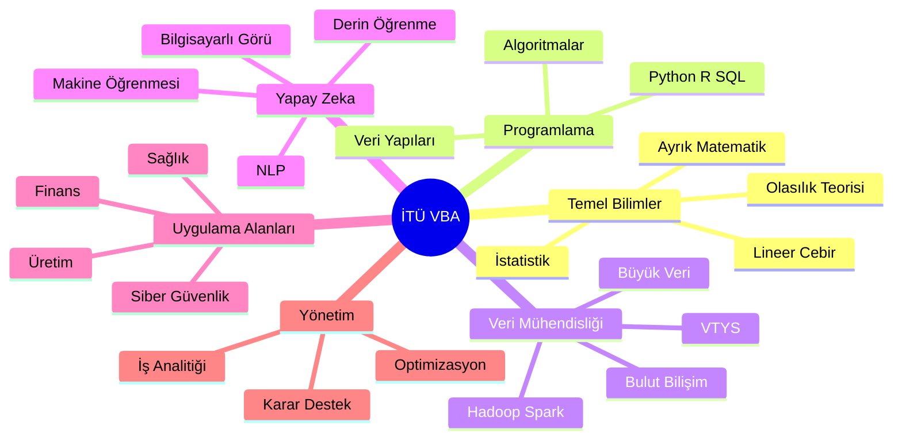
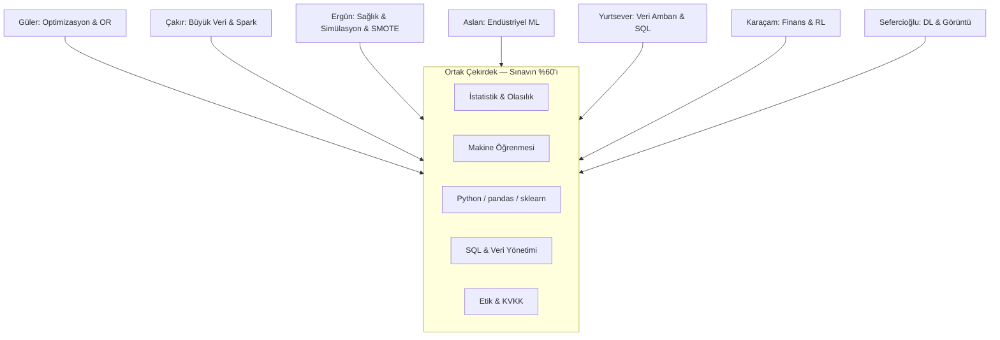
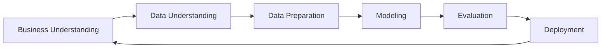
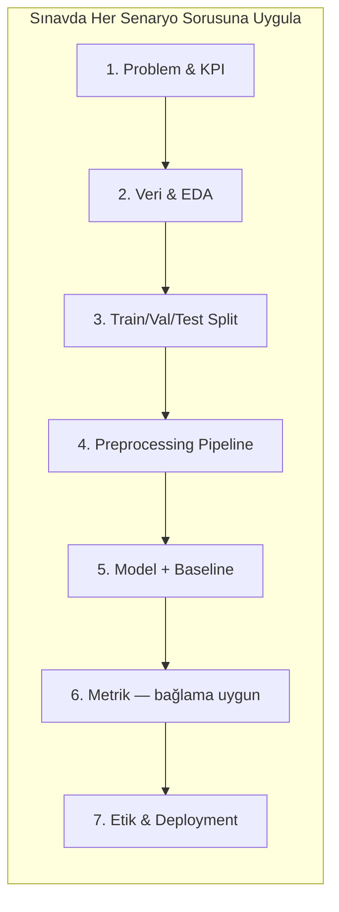

# İTÜ Veri Bilimi ve Analitiği Bölümü — Araştırma Görevlisi Yazılı Sınav Kapsamlı Çalışma Rehberi

> **Hazırlık kapsamı:** İTÜ İşletme Fakültesi, Veri Bilimi ve Analitiği Bölümü (VBA)  
> **Kaynaklar:** [vba.itu.edu.tr](https://vba.itu.edu.tr/hakkimizda), [TYYÇ Program Sayfası](https://tyyc.itu.edu.tr/ProgramHakkinda.php?Dili=TR&Program=VBA_LS), İTÜ Akademi profilleri, Google Scholar / research.itu.edu.tr  
> **Not:** Akademi sayfaları doğrudan fetch sırasında zaman aşımına uğradı; bilgiler web araması, İngilizce akademi sayfaları ve araştırma portallarından doğrulandı.

---

## İçindekiler

1. [Bölüm Genel Bakış](#1-bölüm-genel-bakış)
2. [Öğretim Üyesi Araştırma Haritası](#2-öğretim-üyesi-araştırma-haritası)
3. [Muhtemel Sınav Konuları (Faculty-Driven)](#3-muhtemel-sınav-konuları)
4. [Konu Bazlı Çalışma Kağıdı](#4-konu-bazlı-çalışma-kağıdı)
5. [Ders Anlatımı (Prof.Dr. Perspektifi)](#5-ders-anlatımı)
6. [Uygulama Soruları ve Detaylı Çözümler](#6-uygulama-soruları)
7. [100 Puan İçin Strateji](#7-100-puan-için-strateji)

---

## 1. Bölüm Genel Bakış

### 1.1 Kimlik ve Konum

| Özellik | Detay |
|---------|-------|
| **Kuruluş** | 2024, İTÜ İşletme Fakültesi |
| **İlk öğrenci kontenjanı** | 30 (YKS 2024) |
| **Eğitim dili** | %100 İngilizce |
| **Yerleşke** | Maçka Kampüsü, İstanbul |
| **Bölüm Başkanı** | Prof. Dr. Mehmet Güray Güler |
| **Başkan Yardımcısı** | Dr. Öğr. Üyesi Mehmet Ali Ergün |
| **Kalite/Akreditasyon Sorumlusu** | Prof. Dr. Muammer Altan Çakır |

### 1.2 Misyon ve Vizyon

**Misyon:** Veri bilimi ve analitiği alanında uluslararası standartlarda eğitim vererek akademiye ve endüstriye değer katan mezunlar yetiştirmek.

**Vizyon:** Uluslararası düzeyde tanınan, yenilikçi ve sürdürülebilir araştırmalar üreterek Türkiye ve dünyada dijital dönüşüme yön vermek.

### 1.3 Disiplinlerarası Yapı

Bölüm; **matematik, istatistik, bilgisayar bilimi ve yönetim bilimlerini** bir araya getirir. Mezun profili yalnızca “kod yazan analist” değil; **eleştirel düşünen, etik değerlere sahip, iletişim becerisi güçlü veri bilimci**dir.



### 1.4 Program Eğitim Amaçları (Sınavda “Bölümü tanımlayın” sorusu gelebilir)

Program şu yetkinlikleri hedefler:

1. Veri toplama, temizleme, işleme (ETL)
2. Optimizasyon ve modelleme ile **karar destek sistemleri**
3. İstatistiksel modelleme ve **veri madenciliği**
4. Python, R, SQL ile veri odaklı yazılım
5. Denetimli/denetimsiz ML, DL, NLP, CV, **zaman serisi**
6. Ölçeklenebilir sistemler: bulut, dağıtık işleme, veri gölleri
7. **KVKK/GDPR** uyumu, veri güvenliği, etik

### 1.5 Program Çıktıları (PÇ1–PÇ6)

| Kod | Çıktı | Sınav bağlantısı |
|-----|-------|------------------|
| **PÇ1** | Temel kavramlar + istatistik + veri madenciliği | İstatistik, CRISP-DM |
| **PÇ2** | Farklı veri türlerini analiz etme | Yapılandırılmış/yapılandırılmamış veri |
| **PÇ3** | Analitik düşünme, problem çözme | Optimizasyon, ML pipeline |
| **PÇ4** | Veri görselleştirme ve raporlama | Matplotlib, Seaborn, dashboard |
| **PÇ5** | Veri güvenliği ve gizlilik | KVKK, GDPR, anonymization |
| **PÇ6** | Etik ve sosyal etki | Bias, fairness, sorumlu AI |

### 1.6 Müfredat Özeti (Yıl Bazlı)

| Yıl | Öne çıkan dersler |
|-----|-------------------|
| **1** | Matematik I-II, Ayrık Matematik, Algoritma/Programlama, Veri Bilimine Giriş, Linux |
| **2** | Olasılık, Lineer Cebir, İstatistik, Veri Görselleştirme, VTYS, Veri Yapıları, Veri Analitiği, Stokastik Modeller |
| **3–4** | Makine Öğrenmesi, Derin Öğrenme, Büyük Veri, Sinyal/Görüntü Analitiği, IoT, Siber Güvenlik, Bulut Bilişim |

**Arş.Gör. sınavı için çıkarım:** Bölüm yeni olduğundan sınav, lisans müfredatının **temel omurgasını** (istatistik, ML, SQL, Python, araştırma yöntemi) ve **kadro araştırma alanlarını** kesiştiren konulara odaklanır.

---

## 2. Öğretim Üyesi Araştırma Haritası

### 2.1 Prof. Dr. Mehmet Güray Güler — Bölüm Başkanı

| Alan | Detay |
|------|-------|
| **Çalışma alanları** | Modelleme ve Optimizasyon, Makine Öğrenmesi, Yöneylem Araştırması |
| **Eğitim** | Boğaziçi Üniversitesi Endüstri Mühendisliği (Dr.) |
| **Yayın temaları** | Hidrojen tedarik zinciri optimizasyonu, biyoinformatik, sınav programlama (timetabling), karar destek sistemleri, tedarik zinciri koordinasyonu |
| **Öne çıkan yayınlar** | *Design of a future hydrogen supply chain* (Int. J. Hydrogen Energy), *Examination timetabling DSS* (Expert Systems with Applications) |

**Sınav vurgusu:** Doğrusal/tamsayılı programlama, optimizasyon, karar destek, ML’in operasyon araştırması ile entegrasyonu.

---

### 2.2 Prof. Dr. Muammer Altan Çakır — Kalite/Akreditasyon, Erasmus Koordinatörü

| Alan | Detay |
|------|-------|
| **Çalışma alanları** | Yüksek Enerji Fiziği, Büyük Veri Teknolojileri, Batch Sistemleri, **Apache Spark, Hadoop** |
| **Rol** | İTÜ-CMS (CERN) araştırma grubu lideri; VBA’da misafir/adjunct öğretim üyesi (2024+) |
| **Endüstri** | Parton Büyük Veri Analitiği, Adin.Ai (AI pazarlama optimizasyonu) |
| **Projeler** | GPU tabanlı dağıtık DL, ölçeklenebilir açık kaynak büyük veri mimarisi, CMS online veri görselleştirme |

**Sınav vurgusu:** MapReduce mantığı, Spark RDD/DataFrame, Hadoop ekosistemi, dağıtık işleme, büyük veri mimarisi (lambda/kappa), bulut (AWS).

---

### 2.3 Dr. Öğr. Üyesi Mehmet Ali Ergün — Bölüm Başkan Yardımcısı

| Alan | Detay |
|------|-------|
| **Eğitim** | Boğaziçi Bilgisayar Mühendisliği (Lisans), Wisconsin-Madison (Bütünleşik Doktora) |
| **Araştırma** | Sağlık analitiği, simülasyon modelleme, stokastik optimizasyon, pekiştirmeli öğrenme, dengesiz veri (SMOTE) |
| **Yayın temaları** | Meme kanseri tarama simülasyon modelleri, COVID-19 sağlık etkisi, böbrek nakli optimizasyonu, **Genetic Dual Borderline SMOTE**, **Manufacturing Analytics** |
| **Anahtar beceriler** | Karar analitiği, simülasyon kalibrasyonu, active learning, tahmin modelleme |

**Sınav vurgusu:** Sınıf dengesizliği, SMOTE ailesi, ROC/AUC, simülasyon vs ML, sağlık verisi etiği, cost-sensitive learning.

---

### 2.4 Araş. Gör. Arda Aslan

| Alan | Detay |
|------|-------|
| **Çalışma alanları** | Veri Analitiği, Makine Öğrenmesi, Büyük Veri |
| **Eğitim** | Sabancı Bilgisayar Bilimi + İTÜ Endüstri Mühendisliği (Lisans), İTÜ Endüstri Mühendisliği (Dr. devam) |
| **Endüstri** | TUSAŞ Tasarım Mühendisi (2023–2025) |

**Sınav vurgusu:** Endüstriyel/havacılık veri analitiği, ML pipeline, feature engineering.

---

### 2.5 Araş. Gör. Buse Yurtsever

| Alan | Detay |
|------|-------|
| **Profil** | İTÜ VBA Araştırma Görevlisi |
| **Deneyim** | Yapı Kredi Teknoloji — Risk Veri Ambarı (SQL, veri modelleme, ETL); Abdi İbrahim bütçe raporlama |
| **Beceriler** | SQL optimizasyonu, veri ambarı, bankacılık veri modelleri, iş analitiği |

**Sınav vurgusu:** SQL (JOIN, window functions, CTE), star/snowflake schema, ETL, veri ambarı vs veri gölü.

---

### 2.6 Araş. Gör. Kubilay Karaçam

| Alan | Detay |
|------|-------|
| **Çalışma alanları** | Yapay Zeka, Makine Öğrenmesi, **Finansal Mühendislik** |
| **Eğitim** | İTÜ İnşaat + İşletme Mühendisliği (çift anadal), Büyük Veri ve İş Analitiği (YL), Endüstri Mühendisliği (Dr.) |
| **Yayın** | *Inferring latent trading motivations in Borsa Istanbul: A comparative inverse reinforcement learning approach* (Borsa Istanbul Review, 2026) |

**Sınav vurgusu:** Zaman serisi, finansal ML, reinforcement learning temelleri, risk metrikleri, portföy optimizasyonu.

---

### 2.7 Araş. Gör. Necati Sefercioğlu

| Alan | Detay |
|------|-------|
| **Çalışma alanları** | Agentic AI, Derin Öğrenme, Tıbbi Görüntüleme |
| **Eğitim** | İTÜ Elektronik ve Haberleşme Mühendisliği (Lisans), Büyük Veri ve İş Analitiği (YL planlı) |
| **Araştırma** | İTÜ BIAI Lab — düşük doz CT rekonstrüksiyonu; *Task-Adaptive Low-Dose CT Reconstruction* (arXiv 2025) |
| **Teknik** | CNN, transfer learning, loss function tasarımı, AWS |

**Sınav vurgusu:** CNN temelleri, görüntü işleme, transfer learning, model değerlendirme (Dice, IoU), DL pipeline.

---

### 2.8 Kadro Araştırma Kesişim Diyagramı



---

## 3. Muhtemel Sınav Konuları

### 3.1 Konu Ağırlık Tahmini

| Ağırlık | Konu | Gerekçe |
|---------|------|---------|
| **%20** | Tanımlayıcı istatistik, olasılık, hipotez testleri, güven aralığı | Müfredat temeli; tüm kadro için ortak dil |
| **%18** | Denetimli/denetimsiz ML, model seçimi, overfitting, cross-validation | Ergün, Aslan, Karaçam, Güler |
| **%12** | Feature engineering, veri temizleme, EDA | PÇ1, PÇ2; pratik beceri |
| **%10** | SQL (JOIN, aggregation, subquery, window) | Yurtsever profili; VTYS dersi |
| **%10** | Python/pandas/sklearn uygulama mantığı | Tüm araştırma görevlileri |
| **%8** | Veri madenciliği (CRISP-DM, association, clustering) | Program çıktıları |
| **%7** | Büyük veri (Hadoop/Spark kavramsal) | Çakır |
| **%5** | Derin öğrenme temelleri (CNN, backprop) | Sefercioğlu |
| **%5** | Optimizasyon / karar destek | Güler |
| **%5** | A/B testing, istatistiksel anlamlılık | Ergün sağlık analitiği |
| **%5** | Araştırma etiği, KVKK, akademik yazım | PÇ5, PÇ6 |

### 3.2 Soru Tipi Beklentisi

1. **Tanım / kavram:** “Overfitting nedir? Nasıl önlenir?”
2. **Karşılaştırma:** “Veri ambarı vs veri gölü”, “L1 vs L2 regularization”
3. **Hesaplama:** Bayes, varyans, güven aralığı, precision/recall
4. **SQL yazma:** 2–3 tablo JOIN + GROUP BY
5. **Senaryo:** “Dengesiz veri setinde hangi yöntemleri kullanırsınız?” (Ergün/SMOTE)
6. **Bölüm bilgisi:** Misyon, PÇ’ler, disiplinlerarası yapı
7. **Etik:** KVKK ilkeleri, bias-fairness

---

## 4. Konu Bazlı Çalışma Kağıdı

---

### 4.1 İstatistik ve Olasılık

#### Temel Tanımlar

| Kavram | Tanım | Formül |
|--------|-------|--------|
| **Populasyon / Örneklem** | Populasyon: tüm birimler; örneklem: alt küme | — |
| **Ortalama** | Aritmetik ortalama | \(\bar{x} = \frac{1}{n}\sum_{i=1}^{n} x_i\) |
| **Varyans (örneklem)** | Ortalama kare sapma | \(s^2 = \frac{1}{n-1}\sum_{i=1}^{n}(x_i - \bar{x})^2\) |
| **Standart sapma** | Varyansın karekökü | \(s = \sqrt{s^2}\) |
| **Kovaryans** | İki değişkenin birlikte değişimi | \(\text{Cov}(X,Y) = E[(X-E[X])(Y-E[Y])]\) |
| **Korelasyon (Pearson)** | -1 ile +1 arası doğrusal ilişki | \(r = \frac{\text{Cov}(X,Y)}{s_X s_Y}\) |

#### Olasılık

- **Koşullu olasılık:** \(P(A|B) = \frac{P(A \cap B)}{P(B)}\)
- **Bayes:** \(P(A|B) = \frac{P(B|A)P(A)}{P(B)}\)
- **Beklenen değer:** \(E[X] = \sum x_i P(x_i)\)
- **Varyans:** \(\text{Var}(X) = E[X^2] - (E[X])^2\)

#### Dağılımlar (Sık Sorulan)

| Dağılım | Kullanım | Parametreler |
|---------|----------|--------------|
| **Normal** | Sürekli, simetrik | \(\mu, \sigma\) |
| **Binom** | n deneme, k başarı | \(n, p\) |
| **Poisson** | Nadir olay sayısı | \(\lambda\) |
| **t** | Küçük örneklem, bilinmeyen \(\sigma\) | df |
| **Ki-kare** | Varyans/kategorik test | df |

#### Hipotez Testi Adımları

1. \(H_0\) ve \(H_1\) kur
2. Anlamlılık düzeyi seç (\(\alpha = 0.05\))
3. Test istatistiği hesapla
4. p-değeri veya kritik bölge ile karar ver
5. **Tip I hata:** \(H_0\) doğruyken reddetme (α)
6. **Tip II hata:** \(H_0\) yanlışken kabul etme (β); **Güç = 1 - β**

#### Güven Aralığı (Normal, bilinen σ)

\[
\bar{x} \pm z_{\alpha/2} \cdot \frac{\sigma}{\sqrt{n}}
\]

Örneklem büyük, σ bilinmiyorsa: \(t\) dağılımı kullanılır.

#### Merkezi Limit Teoremi (CLT)

\(n\) yeterince büyükse (\(n \geq 30\) kuralı), örneklem ortalaması yaklaşık normal dağılır — ML’de bootstrap ve A/B testlerinin temeli.

---

### 4.2 Makine Öğrenmesi

#### Öğrenme Türleri

| Tür | Alt türler | Örnek algoritmalar |
|-----|------------|-------------------|
| **Denetimli** | Sınıflandırma, regresyon | LR, SVM, RF, XGBoost, k-NN |
| **Denetimsiz** | Kümeleme, boyut indirgeme | k-Means, DBSCAN, PCA |
| **Yarı-denetimli** | Az etiketli veri | Self-training |
| **Pekiştirmeli** | Ödül maksimizasyonu | Q-learning, DQN, IRL (Karaçam) |

#### Bias-Variance Tradeoff

- **Yüksek bias (underfitting):** Model çok basit
- **Yüksek variance (overfitting):** Model eğitim verisine aşırı uyum
- **Çözümler:** Regularization (L1/L2), dropout, early stopping, daha fazla veri, cross-validation, feature selection

#### Regularization

| Tür | Ceza terimi | Etki |
|-----|---------------|------|
| **L2 (Ridge)** | \(\lambda \sum w_i^2\) | Ağırlıkları küçültür |
| **L1 (Lasso)** | \(\lambda \sum |w_i|\) | Sparse model, feature selection |

#### Cross-Validation

- **k-Fold CV:** Veriyi k parçaya böl, her seferinde 1 parça test
- **Stratified k-Fold:** Sınıf oranını korur (dengesiz veride önemli — Ergün)
- **Leave-One-Out:** n-fold, pahalı

#### Sınıflandırma Metrikleri

| Metrik | Formül | Ne zaman? |
|--------|--------|-----------|
| **Accuracy** | (TP+TN)/Total | Dengeli sınıflar |
| **Precision** | TP/(TP+FP) | FP maliyeti yüksek (spam) |
| **Recall (Sensitivity)** | TP/(TP+FN) | FN maliyeti yüksek (kanser tarama) |
| **F1** | \(2PR/(P+R)\) | Dengesiz sınıflar |
| **ROC-AUC** | TPR vs FPR eğrisi altı alan | Eşik bağımsız karşılaştırma |

**Ergün bağlamı:** Meme kanseri taramada **recall** kritik; dolandırıcılık tespitinde **precision**.

#### Confusion Matrix

```
                 Tahmin
              Pos    Neg
Gerçek Pos    TP     FN
       Neg    FP     TN
```

#### Önemli Algoritmalar — Özet

**Lojistik Regresyon:** Sigmoid ile olasılık; \(\sigma(z) = 1/(1+e^{-z})\)

**Karar Ağacı:** Gini veya Entropy ile split  
\(Gini = 1 - \sum p_i^2\)

**Random Forest:** Bagging + rastgele feature subset; overfitting’e dirençli

**SVM:** Maksimum margin hyperplane; kernel trick (RBF, polynomial)

**k-Means:** Küme merkezlerini iteratif güncelle; \(J = \sum\sum ||x_i - \mu_j||^2\)

**Gradient Boosting:** Sıralı zayıf öğrenici birleştirme; XGBoost/LightGBM endüstri standardı

---

### 4.3 Dengesiz Veri ve SMOTE (Ergün Odak)

#### Problem
Minority sınıf az olduğunda model majority’ye bias olur.

#### Yöntemler

| Yöntem | Açıklama |
|--------|----------|
| **Undersampling** | Majority azalt |
| **Oversampling** | Minority çoğalt |
| **SMOTE** | k-NN komşular arasında sentetik örnek üret |
| **Borderline-SMOTE** | Sınırda kalan (tehlikedeki) örnekleri hedefle |
| **Genetic Dual Borderline SMOTE** | Ergün — genetik algoritma ile parametre optimizasyonu; F1 artışı |

**SMOTE adımı (basit):**
1. Minority sınıftan rastgele örnek \(x\) seç
2. k en yakın minority komşusundan \(x_{nn}\) seç
3. \(x_{new} = x + \lambda(x_{nn} - x)\), \(\lambda \in [0,1]\)

**Sınav cevabı ipucu:** “Dengesiz veride accuracy yanıltıcıdır; F1, precision-recall curve veya AUC-PR kullanılır; SMOTE sadece eğitim setine uygulanmalı, test setine değil (data leakage!).”

---

### 4.4 Veri Madenciliği

#### CRISP-DM Döngüsü



1. **İş anlama**
2. **Veri anlama** (EDA)
3. **Veri hazırlama** (temizleme, dönüştürme)
4. **Modelleme**
5. **Değerlendirme**
6. **Deployment**

#### Veri Madenciliği Görevleri

| Görev | Yöntem | Örnek |
|-------|--------|-------|
| **Sınıflandırma** | ML | Churn tahmini |
| **Kümeleme** | k-Means, DBSCAN | Müşteri segmentasyonu |
| **Association Rule** | Apriori | Market basket: {ekmek} → {tereyağı} |
| **Anomaly Detection** | Isolation Forest | Dolandırıcılık |
| **Sequential Pattern** | PrefixSpan | Tıklama dizisi |

#### Apriori Metrikleri

- **Support:** \(P(A \cap B)\)
- **Confidence:** \(P(B|A) = P(A \cap B)/P(A)\)
- **Lift:** \(P(B|A)/P(B)\); lift > 1 pozitif ilişki

---

### 4.5 Feature Engineering

| Teknik | Açıklama |
|--------|----------|
| **Encoding** | One-hot (nominal), Label (ordinal dikkatli), Target encoding |
| **Scaling** | StandardScaler (z-score), MinMaxScaler |
| **Missing values** | Mean/median imputation, KNN imputation, model-based |
| **Outlier** | IQR, Z-score, isolation |
| **Feature creation** | Tarih → gün/ay/mevsim; metin → TF-IDF, embeddings |
| **Feature selection** | Filter (correlation), Wrapper (RFE), Embedded (Lasso) |

**Data leakage uyarısı:** Hedef değişkenden türetilen feature, gelecek bilgisi içeren feature — train-test split **önce**, preprocessing **sonra** (pipeline içinde).

---

### 4.6 Python, pandas, scikit-learn

#### pandas Temel

```python
import pandas as pd

df = pd.read_csv("data.csv")
df.head()
df.info()
df.describe()
df.isnull().sum()
df.dropna()                    # eksik sil
df.fillna(df.mean())           # ortalama ile doldur
df.groupby("category")["value"].mean()
df.merge(df2, on="id", how="left")
df["date"] = pd.to_datetime(df["date"])
```

#### sklearn Pipeline (Sınavda mantık sorusu)

```python
from sklearn.model_selection import train_test_split, cross_val_score
from sklearn.preprocessing import StandardScaler
from sklearn.linear_model import LogisticRegression
from sklearn.pipeline import Pipeline

X_train, X_test, y_train, y_test = train_test_split(X, y, test_size=0.2, stratify=y, random_state=42)

pipe = Pipeline([
    ("scaler", StandardScaler()),
    ("clf", LogisticRegression(max_iter=1000))
])
pipe.fit(X_train, y_train)
scores = cross_val_score(pipe, X_train, y_train, cv=5, scoring="f1")
```

**Kritik kurallar:**
- `fit` sadece train’de
- `transform`/`predict` test’te
- `random_state` tekrarlanabilirlik için

---

### 4.7 SQL

#### Temel Komutlar

```sql
-- Filtreleme ve sıralama
SELECT customer_id, SUM(amount) AS total
FROM orders
WHERE order_date >= '2024-01-01'
GROUP BY customer_id
HAVING SUM(amount) > 1000
ORDER BY total DESC
LIMIT 10;
```

#### JOIN Türleri

| JOIN | Sonuç |
|------|-------|
| **INNER** | Eşleşen kayıtlar |
| **LEFT** | Sol tablo + eşleşen sağ |
| **RIGHT** | Sağ tablo + eşleşen sol |
| **FULL OUTER** | Tüm kayıtlar |
| **CROSS** | Kartezyen çarpım |

#### Window Functions (Yurtsever profili — bankacılık analitiği)

```sql
SELECT
    customer_id,
    transaction_date,
    amount,
    SUM(amount) OVER (PARTITION BY customer_id ORDER BY transaction_date
                      ROWS BETWEEN UNBOUNDED PRECEDING AND CURRENT ROW) AS running_total,
    ROW_NUMBER() OVER (PARTITION BY customer_id ORDER BY amount DESC) AS rn
FROM transactions;
```

#### Veri Ambarı Şemaları

| Şema | Yapı | Kullanım |
|------|------|----------|
| **Star Schema** | Fact + dimension tablolar | OLAP, hızlı sorgu |
| **Snowflake** | Normalize dimension | Depolama tasarrufu |
| **Data Vault** | Hub-Link-Satellite | Büyük kurumsal DWH |

**Veri Ambarı vs Veri Gölü:**
- **DWH:** Yapılandırılmış, schema-on-write, ETL, raporlama
- **Data Lake:** Ham + yapılandırılmış, schema-on-read, büyük hacim, ML

---

### 4.8 A/B Testing

#### Süreç

1. Hipotez: “Yeni algoritma conversion’ı artırır”
2. \(H_0: p_A = p_B\) vs \(H_1: p_A \neq p_B\)
3. Rastgele kullanıcı ataması (randomization)
4. Yeterli örneklem (power analysis)
5. Test istatistiği (z-test, t-test, chi-square)
6. p < α ise \(H_0\) reddedilir

#### Örneklem Büyüklüğü (Oranlar için, yaklaşık)

\[
n \approx \frac{(z_{\alpha/2}\sqrt{2\bar{p}(1-\bar{p})} + z_\beta\sqrt{p_1(1-p_1)+p_2(1-p_2)})^2}{(p_1-p_2)^2}
\]

#### Yaygın Hatalar

- **Peeking:** Erken sonuç okuma
- **Multiple testing:** Çok metrik → Bonferroni düzeltmesi
- **Selection bias:** Rastgele olmayan atama
- **Simpson paradoksu:** Segmentler ters yönde

---

### 4.9 Büyük Veri (Çakır Odak)

#### 5V Özellikleri

**Volume, Velocity, Variety, Veracity, Value**

#### Hadoop Ekosistemi

| Bileşen | İşlev |
|---------|-------|
| **HDFS** | Dağıtık dosya sistemi |
| **MapReduce** | Map → Shuffle → Reduce |
| **YARN** | Kaynak yönetimi |

**MapReduce örneği (Word Count):**
- Map: (kelime, 1) çiftleri üret
- Shuffle: aynı kelimeleri grupla
- Reduce: topla

#### Apache Spark

| Kavram | Açıklama |
|--------|----------|
| **RDD** | Dağıtık, immutable veri koleksiyonu |
| **DataFrame/Dataset** | Yapılandırılmış API (Spark SQL) |
| **Lazy evaluation** | Transformation’lar ertelenir, action’da çalışır |
| **Caching/Persist** | Tekrar kullanılan RDD’yi bellekte tut |

**Spark vs Hadoop MapReduce:** Spark in-memory, iteratif ML/DL için daha hızlı.

#### Mimari Modeller

- **Lambda:** Batch (Hadoop) + Speed (Spark/Flink) katmanı
- **Kappa:** Tüm veri stream üzerinden

---

### 4.10 Derin Öğrenme Temelleri (Sefercioğlu Odak)

#### Yapay Sinir Ağları

- **Forward pass:** Girdiler → ağırlıklı toplam → aktivasyon (ReLU, sigmoid, softmax)
- **Loss:** Cross-entropy (sınıflandırma), MSE (regresyon)
- **Backpropagation:** Zincir kuralı ile gradyan hesaplama
- **Optimizer:** SGD, Adam, RMSprop

#### CNN (Görüntü — CT Rekonstrüksiyon)

| Katman | İşlev |
|--------|-------|
| **Conv** | Yerel feature extraction (kenar, doku) |
| **Pooling** | Boyut azaltma (max/avg) |
| **FC** | Sınıflandırma/regresyon |

**Transfer Learning:** ImageNet’te eğitilmiş model + fine-tuning (az veriyle tıbbi görüntü)

**Metrikler (segmentasyon):**
- **Dice:** \(2|A \cap B| / (|A| + |B|)\)
- **IoU (Jaccard):** \(|A \cap B| / |A \cup B|\)

**Sefercioğlu çalışması özeti:** Düşük doz CT’de PSNR/SSIM yüksek olsa da diagnostik detay kaybolabilir; task-adaptive loss ile segmentasyon kalitesi (Dice) iyileştirilir.

---

### 4.11 Optimizasyon ve Karar Destek (Güler Odak)

#### Doğrusal Programlama (LP)

\[
\min c^T x \quad \text{s.t.} \quad Ax \leq b, \ x \geq 0
\]

**Simplex** veya **Interior Point** ile çözülür.

#### Tamsayılı Programlama (IP/MIP)

Karar değişkenleri integer — timetabling, tedarik zinciri.

#### Karar Destek Sistemi (KDS) Bileşenleri

1. Veri yönetimi
2. Model yönetimi
3. Kullanıcı arayüzü
4. Bilgi / bilgi tabanı

**Güler örneği:** Sınav programlama DSS — kısıtlar (oda, öğretim üyesi, öğrenci çakışması) + optimizasyon.

---

### 4.12 Finansal ML ve RL (Karaçam Odak)

#### Zaman Serisi Kavramları

- **Trend, mevsimsellik, gürültü**
- **Stationarity:** ADF testi
- **ARIMA(p,d,q):** Otoregresif + fark + hareketli ortalama

#### Reinforcement Learning Temelleri

| Kavram | Tanım |
|--------|-------|
| **Agent** | Karar veren |
| **Environment** | Dış dünya |
| **State** | \(s_t\) |
| **Action** | \(a_t\) |
| **Reward** | \(r_t\) |
| **Policy** | \(\pi(a|s)\) |
| **Q-function** | \(Q(s,a)\) = beklenen toplam ödül |

**Inverse RL (Karaçam):** Ödül fonksiyonu bilinmiyor; gözlemlenen davranıştan (Borsa İstanbul aracı kurum işlemleri) gizli motivasyon çıkarılır.

---

### 4.13 Araştırma Metodolojisi ve Akademik Yazım

#### Bilimsel Yöntem Adımları

1. Problemi tanımla
2. Literatür taraması
3. Hipotez/model kur
4. Veri topla / dene
5. Analiz et
6. Sonuçları yorumla
7. Yayınla / tekrarlanabilirliği sağla

#### Makale Yapısı (IMRaD)

- **Introduction:** Problem, boşluk, katkı
- **Methods:** Veri, model, metrik
- **Results:** Tablo/grafik
- **Discussion:** Yorum, sınırlılık, gelecek çalışma

#### İyi Araştırma Pratikleri

- Train/validation/test ayrımı
- Baseline karşılaştırması
- Ablation study
- Reproducibility (seed, kod, veri versiyonu)
- **p-hacking** ve **HARKing**’den kaçın

---

### 4.14 Veri Etik, KVKK, GDPR

#### KVKK Temel İlkeleri (Madde 4)

1. Hukuka ve dürüstlük kurallarına uygun işleme
2. Doğru ve gerektiğinde güncel olma
3. Belirli, açık ve meşru amaçlar için işleme
4. İşlendikleri amaçla bağlantılı, sınırlı ve ölçülü olma
5. İlgili mevzuatta öngörülen veya işlendikleri amaç için gerekli süre kadar muhafaza
6. Veri sorumlusunun gerekli tedbirleri alması

#### GDPR Ek Kavramlar

- **Data minimization**
- **Right to be forgotten**
- **Privacy by design**
- **DPIA** (Data Protection Impact Assessment)

#### ML Etik Sorunları

| Sorun | Açıklama | Çözüm |
|-------|----------|-------|
| **Bias** | Tarihsel verideki önyargı | Fairness metrikleri, dengeli veri |
| **Fairness** | Demografik parite vs equalized odds | Bağlama göre seçim |
| **Explainability** | Kara kutu modeller | SHAP, LIME |
| **Accountability** | Sorumluluk zinciri | Model kartları, audit log |

---

## 5. Ders Anlatımı

*Bu bölüm, sınavda “açıklayınız / anlatınız” tipi sorulara doğrudan cevap verecek yoğunlukta yazılmıştır.*

---

### Ders 1: Veri Bilimi Nedir ve İTÜ VBA Neden Farklı?

Veri bilimi, **istatistik, bilgisayar bilimi ve alan bilgisini** birleştirerek veriden eyleme geçirilebilir içgörü üreten disiplindir. Klasik istatistik “bu ilişki anlamlı mı?” diye sorarken; veri bilimi ayrıca “bu ilişkiyi ölçeklenebilir bir sistemde nasıl otomatikleştiririm?” sorusunu sorar.

İTÜ VBA’nın ayırt edici yönü üç katmanlıdır:

1. **Mühendislik disiplini:** İTÜ’nin analitik geleneği — optimizasyon (Güler), büyük veri altyapısı (Çakır).
2. **Yönetim perspektifi:** Karar destek, iş analitiği, stratejik veri kullanımı.
3. **Etik ve sorumluluk:** PÇ5–PÇ6; KVKK uyumu sırf hukuk değil, mühendislik gereksinimidir.

Bir veri bilimci dört soruyu sırayla yanıtlamalıdır:
- Doğru soru soruldu mu? (problem tanımı)
- Doğru veri var mı? (kalite, temsil)
- Doğru model mi? (basit → karmaşık)
- Doğru karar mı? (iş etkisi, etik)

---

### Ders 2: İstatistiğin ML’deki Rolü

Makine öğrenmesi, istatistiğin hesaplamalı ve ölçeklenebilir uzantısıdır. Her ML algoritması bir varsayım taşır:

- **Lineer regresyon:** Doğrusallık, homoskedastisite, bağımsız hatalar
- **Naive Bayes:** Koşullu bağımsızlık
- **Lojistik regresyon:** Logit link

Hipotez testi ile model değerlendirme farklı amaç taşır:
- Hipotez testi: Populasyon parametresi hakkında karar
- ML metrikleri: Genelleme performansı tahmini

**Güven aralığı vs tahmin aralığı:**
- Güven aralığı: \(\bar{x}\)’in düştüğü aralık (frekansist)
- Tahmin aralığı: Tek bir gözlem için aralık (daha geniş)

---

### Ders 3: Overfitting Mekanizması

Overfitting, modelin eğitim verisindeki **gürültüyü sinyal sanmasıdır**. Düşük bias + yüksek variance durumudur.

Önleme stratejileri (sınavda liste halinde yazın):

1. **Daha fazla veri** — en etkili
2. **Regularization** — L2 ağırlıkları küçültür
3. **Early stopping** — validation loss artınca dur
4. **Dropout** (DL) — nöronları rastgele kapat
5. **Cross-validation** — gerçekçi performans tahmini
6. **Feature selection** — gereksiz boyut azalt
7. **Ensemble** — Random Forest, bagging variance azaltır

**Önemli:** Test seti **bir kez** kullanılır; hyperparameter tuning için validation seti ayrılır.

---

### Ders 4: Dengesiz Veri — Ergün Perspektifi

Sağlık analitiğinde nadir olay (hastalık, ölüm) tahmini klasik dengesizlik örneğidir. %99 sağlıklı veride %99 accuracy’ye ulaşan “boş model” klinik olarak işe yaramaz.

**Strateji hiyerarşisi:**

1. Metrik değiştir (F1, AUC-PR)
2. Eşik ayarla (ROC eğrisinde işletme maliyetine göre nokta seç)
3. Class weight (`class_weight='balanced'`)
4. Resampling (SMOTE — **sadece train**)
5. Anomaly detection yaklaşımı (nadir olay = anomali)

**Genetic Dual Borderline SMOTE:** Borderline SMOTE sınır örneklerini hedefler; genetik algoritma en iyi hiperparametre kombinasyonunu arar. Ergün’ün katkısı: manufacturing ve genel ML’de minority F1’i artırmak.

---

### Ders 5: Büyük Veri — Çakır Perspektifi

CERN CMS deneyi saniyede milyonlarca çarpışma olayı üretir; %99’u filtrelenir, kalan petabyte ölçeğinde saklanır. Bu, kurumsal büyük veriyle aynı mantıktır: **hacim ölçeklenebilir mimari gerektirir**.

MapReduce programlama modeli veriyi düğümlere dağıtır; Spark bellek-içi hesaplamayla iteratif algoritmaları (ML, graph) hızlandırır.

Sınavda “Spark neden Hadoop’tan hızlı?” sorusunun cevabı:
- In-memory processing
- DAG execution engine
- Lazy evaluation + optimizasyon (Catalyst optimizer)

---

### Ders 6: Derin Öğrenme — Sefercioğlu Perspektifi

Tıbbi görüntüde iki paradigma vardır:

1. **Görüntü kalitesi metrikleri** (PSNR, SSIM) — piksel düzeyi
2. **Görev metrikleri** (Dice, segmentasyon) — klinik düzey

Sefercioğlu’nun task-adaptive framework’ü şunu gösterir: **Loss fonksiyonu iş problemine göre tasarlanmalıdır.** Frozen pre-trained task network, reconstruction loss’a regularizer olarak eklenir; joint training’e göre diagnostik kalite korunur.

Sınav cevabı: “Derin öğrenmede veri artırma (augmentation), transfer learning ve uygun loss seçimi az veri problemine karşı üç temel stratejidir.”

---

### Ders 7: SQL ve Veri Ambarı — Yurtsever Perspektifi

Bankacılık risk veri ambarında veri **günlük ETL** ile staging → dimension/fact tablolarına akar. Analist SQL ile aggregasyon yapar; ML ekibi aynı DWH’den feature store besler.

**Star schema avantajı:** JOIN sayısı az, sorgu hızlı, iş kullanıcıları anlayabilir.

Window function ile “her müşterinin son 3 işleminin ortalaması” gibi temporal feature’lar üretilir — ML feature engineering’in SQL karşılığı.

---

### Ders 8: Finansal Veri Bilimi — Karaçam Perspektifi

Borsa verisi non-stationary, heteroskedastic ve gürültülüdür. Klasik regresyon yetersiz kalabilir; RL ile aracı kurum davranışı modellenir.

**Inverse RL:** Gözlemlenen trajectories → reward function tahmini. Finansta “kurum neden bu emri verdi?” sorusuna yanıt arar.

Sınavda RL tanımı: Agent, environment ile etkileşerek cumulative reward’u maksimize eder; exploration vs exploitation dengesi (ε-greedy) kritiktir.

---

## 6. Uygulama Soruları

---

### BÖLÜM A — Bölüm ve Kadro Bilgisi

**S1.** İTÜ Veri Bilimi ve Analitiği Bölümü’nün misyonunu ve disiplinlerarası yapısını açıklayınız.

<details>
<summary>Detaylı Cevap</summary>

**Misyon:** Veri bilimi ve analitiği alanında uluslararası standartlarda eğitim vererek akademiye ve endüstriye değer katan mezunlar yetiştirmek.

**Disiplinlerarası yapı:** Matematik (olasılık, lineer cebir), istatistik, bilgisayar bilimi (programlama, algoritmalar, VTYS, ML/DL) ve yönetim bilimleri (optimizasyon, karar destek, iş analitiği) bir araya gelir. Bölüm 2024’te kurulmuş, eğitim dili %100 İngilizcedir, Maçka yerleşkesindedir.

**Program çıktıları** istatistiksel yöntemler, veri madenciliği, analitik düşünme, görselleştirme, veri güvenliği ve etik yetkinliklerini kapsar (PÇ1–PÇ6).

</details>

---

**S2.** Prof. Dr. Mehmet Güray Güler ve Dr. Öğr. Üyesi Mehmet Ali Ergün’ün araştırma alanlarını karşılaştırınız. Sınavda hangi konular öne çıkabilir?

<details>
<summary>Detaylı Cevap</summary>

| | Güler | Ergün |
|---|-------|-------|
| **Odak** | Optimizasyon, OR, tedarik zinciri, timetabling | Sağlık analitiği, simülasyon, ML |
| **Yöntem** | LP/MIP, karar destek sistemleri | Simülasyon modelleme, SMOTE, tahmin |
| **Uygulama** | Hidrojen tedarik zinciri, sınav programlama | Meme kanseri tarama, üretim analitiği |

**Ortak sınav konuları:** ML temelleri, model değerlendirme, karar destek mantığı, Python/sklearn, istatistik.

**Güler’e özel:** Doğrusal programlama, optimizasyon kısıtları, KDS bileşenleri.

**Ergün’e özel:** Dengesiz veri, SMOTE, sağlık verisi etiği, simülasyon vs ML karşılaştırması, cost-sensitive metrikler.

</details>

---

### BÖLÜM B — İstatistik

**S3.** Bir A/B testinde kontrol grubu dönüşüm oranı %5 (n=2000), test grubu %5.8 (n=2000). p-değeri 0.03. Sonucu yorumlayın.

<details>
<summary>Detaylı Cevap</summary>

α = 0.05 için p = 0.03 < 0.05 → \(H_0\) (oranlar eşit) **reddedilir**.

Test grubu dönüşümü istatistiksel olarak anlamlı düzeyde yüksektir. Ancak:
1. **Pratik anlamlılık:** %0.8 mutlak artış iş açısından yeterli mi?
2. **Güven aralığı** hesaplanmalı
3. Test süresi, mevsimsellik, segment etkisi kontrol edilmeli
4. Tek metrik yerine birden fazla metrik varsa **multiple testing** düzeltmesi gerekir

Sonuç: İstatistiksel anlamlılık ≠ otomatik deployment kararı.

</details>

---

**S4.** Normal dağılımda \(P(X > \mu + 2\sigma)\) yaklaşık kaçtır? Empirical rule’u açıklayın.

<details>
<summary>Detaylı Cevap</summary>

**Empirical Rule (68-95-99.7):**
- ±1σ içinde: ~%68
- ±2σ içinde: ~%95
- ±3σ içinde: ~%99.7

\(P(X > \mu + 2\sigma) = P(Z > 2) \approx (100-95)/2 =\) **%2.5**

Outlier tespitinde genellik Z > 3 veya IQR kuralı kullanılır.

</details>

---

**S5.** İki bağımsız olay A ve B için P(A)=0.4, P(B)=0.5, P(A∩B)=0.2. Bağımsız mı?

<details>
<summary>Detaylı Cevap</summary>

Bağımsızlık: \(P(A \cap B) = P(A) \cdot P(B)\)

\(P(A) \cdot P(B) = 0.4 \times 0.5 = 0.2 = P(A \cap B)\)

**Evet, A ve B bağımsızdır.**

Bağımsız değilse: \(P(A|B) = P(A \cap B)/P(B)\)

</details>

---

### BÖLÜM C — Makine Öğrenmesi

**S6.** Precision=0.90, Recall=0.60. F1 skorunu hesaplayın. Hangi senaryoda bu model kabul edilebilir?

<details>
<summary>Detaylı Cevap</summary>

\[
F1 = \frac{2 \times 0.90 \times 0.60}{0.90 + 0.60} = \frac{1.08}{1.50} = 0.72
\]

**Yorum:**
- Yüksek precision → pozitif dediğimizin çoğu doğru (FP düşük)
- Düşük recall → gerçek pozitiflerin %40’ını kaçırıyoruz (FN yüksek)

**Kabul edilebilir:** Spam filtreleme (FP tolere edilmez, FN kabul edilebilir).

**Kabul edilemez:** Kanser tarama (FN hayati — recall artırılmalı, eşik düşürülmeli veya farklı model).

</details>

---

**S7.** k-Fold CV ile hyperparameter tuning yaparken test setine ne zaman dokunulur?

<details>
<summary>Detaylı Cevap</summary>

**Doğru sıra:**
1. Veriyi train + test ayır (ör. 80-20)
2. Test setini **kapat** (lock)
3. Train üzerinde k-fold CV ile hyperparameter seç
4. Seçilen parametrelerle tüm train’de final model eğit
5. **Bir kez** test setinde değerlendir

Test setine CV sırasında dokunmak **optimistic bias** ve **data leakage** üretir.

Nested CV: Dış loop genelleme, iç loop tuning — daha güvenilir ama pahalı.

</details>

---

**S8.** Random Forest neden overfitting’e karşı dayanıklıdır?

<details>
<summary>Detaylı Cevap</summary>

1. **Bagging:** Bootstrap örneklemelerle çok ağaç; variance azalır
2. **Random feature subset:** Her split’te rastgele feature alt kümesi; ağaçlar decorrelated
3. **Majority vote / ortalama:** Bireysel ağaç overfit etse bile ensemble düzgünleşir

Tamamen overfit olmaz ama çok gürültülü veride ve sınırsız derinlikte hâlâ risk vardır; `max_depth`, `min_samples_leaf` ile kontrol edilir.

</details>

---

### BÖLÜM D — Dengesiz Veri (Ergün)

**S9.** %98 majority, %2 minority sınıflı veri setinde SMOTE’u test setine uygularsanız ne olur?

<details>
<summary>Detaylı Cevap</summary>

**Ciddi metodolojik hata (data leakage).**

SMOTE test setinden bilgi sızdırır; sentetik örnekler train dağılımına göre üretildiğinden test performansı **gerçekçi olmayan şekilde iyimser** çıkar.

**Doğru:** SMOTE yalnızca cross-validation’ın train fold’unda, pipeline içinde (`imblearn.pipeline`).

Test seti orijinal dağılımda kalmalı — gerçek dünya senaryosunu temsil eder.

</details>

---

### BÖLÜM E — SQL

**S10.** `customers(id, name)`, `orders(id, customer_id, amount, date)` tablolarında 2024’te toplam harcaması 5000 TL’yi aşan müşterileri bulun.

<details>
<summary>Detaylı Cevap</summary>

```sql
SELECT c.id, c.name, SUM(o.amount) AS total_spent
FROM customers c
INNER JOIN orders o ON c.id = o.customer_id
WHERE o.order_date >= '2024-01-01'
  AND o.order_date < '2025-01-01'
GROUP BY c.id, c.name
HAVING SUM(o.amount) > 5000
ORDER BY total_spent DESC;
```

**Notlar:**
- `WHERE` satır filtresi (JOIN öncesi/sonrası optimizere bağlı)
- `HAVING` grup filtresi (aggregate sonrası)
- `INNER JOIN`: siparişi olmayan müşteri gelmez; istenirse `LEFT JOIN` + `HAVING`

</details>

---

**S11.** Star schema’da fact ve dimension tablolarını açıklayın.

<details>
<summary>Detaylı Cevap</summary>

**Fact table:** Ölçülebilir metrikler (amount, quantity) + dimension foreign key’leri. Çok satır, dar tablo.

**Dimension table:** Bağlam bilgisi (customer, product, time, location). Az satır (görece), geniş tablo.

**Örnek:** `fact_sales(sale_id, customer_key, product_key, time_key, amount)`

Avantaj: OLAP sorguları hızlı, iş kullanıcıları anlaşılır, BI araçlarıyla uyumlu.

</details>

---

### BÖLÜM F — Büyük Veri (Çakır)

**S12.** MapReduce ile Word Count’u açıklayın. Spark’ın avantajını belirtin.

<details>
<summary>Detaylı Cevap</summary>

**Map:** Her satır → (kelime, 1) listesi  
**Shuffle:** Aynı kelime bir düğüme  
**Reduce:** (kelime, toplam_sayı)

**Spark avantajları:**
- Bellek-içi (disk I/O az)
- Iteratif algoritmalar (ML eğitimi) için uygun
- DataFrame API + SQL desteği
- Lazy evaluation ile optimizasyon

Hadoop: Petabyte batch işleme, maliyet-etkin depolama (HDFS).  
Spark: Hız, ML, stream processing (Structured Streaming).

</details>

---

### BÖLÜM G — Derin Öğrenme (Sefercioğlu)

**S13.** Tıbbi görüntü segmentasyonunda Dice skoru neden accuracy’den daha uygundur?

<details>
<summary>Detaylı Cevap</summary>

Tümör pikselleri genellikle görüntünün **küçük bir yüzdesi**dir. Her şeyi “arka plan” diyen model %95+ accuracy verir ama tümörü hiç bulmaz.

**Dice (F1 benzeri segmentasyon metriği):** Overlap ölçer; sınıf dengesizliğine daha dayanıklı.

Sefercioğlu çalışması: PSNR/SSIM yüksek olsa bile diagnostik detay kaybedilebilir → task-specific loss (segmentasyon ağı regularizer) gerekir.

</details>

---

### BÖLÜM H — Optimizasyon (Güler)

**S14.** Sınav programlama problemini KDS + optimizasyon çerçevesinde formüle edin.

<details>
<summary>Detaylı Cevap</summary>

**Karar değişkenleri:** \(x_{ijk}\) = ders i, zaman j, oda k’da mı?

**Amaç:** Çakışma sayısını minimize et veya boş slot minimize et.

**Kısıtlar:**
- Her ders bir kez atanmalı
- Bir öğretim üyesi aynı anda tek ders
- Oda kapasitesi ≥ öğrenci sayısı
- Öğrenci çakışması yok

**KDS bileşenleri:** Veri (ders, öğretim üyesi, oda), model (MIP), UI (program görüntüleme), kural tabanı (tercihler).

Güler’ün çalışması: Web tabanlı DSS + spreadsheet entegrasyonu (Expert Systems with Applications).

</details>

---

### BÖLÜM I — Etik ve KVKK

**S15.** Bir ML modeli kredi skorlamada yaş değişkenine göre ayrımcılık yapıyorsa hangi adımları atarsınız?

<details>
<summary>Detaylı Cevap</summary>

1. **Fairness audit:** Demografik parite, equalized odds analizi
2. **Veri inceleme:** Tarihsel bias (geçmiş ayrımcı uygulamalar)
3. **Feature mühendisliği:** Proxy değişkenleri tespit (postcode → etnik köken proxy)
4. **Model seçimi:** Interpretable model veya fairness-constrained training
5. **Hukuk:** KVKK aydınlatma yükümlülüğü, otomatik kararın açıklanması hakkı (Madde 11)
6. **İnsan denetimi:** Tam otomatik red kararı yerine human-in-the-loop
7. **Dokümantasyon:** Model kartı, bias test raporu

</details>

---

### BÖLÜM J — Python / Uygulama Mantığı

**S16.** Aşağıdaki kodda hata nedir?

```python
scaler = StandardScaler()
X_scaled = scaler.fit_transform(X)
X_train, X_test = train_test_split(X_scaled, y, test_size=0.2)
```

<details>
<summary>Detaylı Cevap</summary>

**Data leakage:** Scaler tüm veri (test dahil) üzerinde fit edilmiş.

**Doğrusu:**
```python
X_train, X_test, y_train, y_test = train_test_split(X, y, test_size=0.2, random_state=42)
scaler = StandardScaler()
X_train_scaled = scaler.fit_transform(X_train)
X_test_scaled = scaler.transform(X_test)  # sadece transform
```

Veya Pipeline kullan.

</details>

---

### BÖLÜM K — Karışık (Sınav Simülasyonu)

**S17.** (Çok sorulu) Bir e-ticaret firması churn tahmini yapacak. Veri: 1M müşteri, %8 churn, 50 feature. Adım adım pipeline tasarlayın.

<details>
<summary>Detaylı Cevap</summary>

**1. İş anlama:** Churn tanımı (30 gün alışveriş yok?), maliyet matrisi (FN vs FP)

**2. EDA:** Eksik değer, dağılım, korelasyon, sınıf dengesizliği (%8)

**3. Veri hazırlık:**
- Train/validation/test (stratified)
- Feature engineering: RFM, recency, frequency, monetary
- Encoding, scaling (pipeline)

**4. Model:**
- Baseline: majority class / lojistik regresyon
- Gelişmiş: XGBoost / Random Forest
- class_weight veya SMOTE (train only)
- Metrik: AUC-PR (dengesiz), F1, recall@top-k

**5. Değerlendirme:** Temporal split (gelecek veri sızıntısı yok), calibration

**6. Deployment:** Batch scoring, model monitoring (data drift), A/B test

**7. Etik:** KVKK, açıklanabilirlik (SHAP), otomatik kampanya kararı denetimi

</details>

---

**S18.** Prof. Çakır’ın CERN deneyimi ile bölümün büyük veri hedefleri arasındaki bağlantıyı açıklayın.

<details>
<summary>Detaylı Cevap</summary>

CERN CMS deneyi **petabyte ölçekli veri**, gerçek zamanlı filtreleme, dağıtık işleme ve ML tabanlı olay seçimi gerektirir. Çakır’ın bu deneyimden getirdiği yetkinlikler:

- Ölçeklenebilir batch/stream mimarisi
- Hadoop/Spark ekosistemi
- GPU tabanlı dağıtık DL
- Online veri görselleştirme

İTÜ VBA müfredatındaki “Büyük Veri ve Analitiği”, “Bulut Bilişim” dersleri bu endüstriyel/ bilimsel ölçek deneyimini öğrencilere aktarmayı hedefler. Kalite sorumluluğu da program standardizasyonu ile ilişkilidir.

</details>

---

## 7. 100 Puan İçin Strateji

### 7.1 Son 72 Saat Çalışma Planı

| Gün | Odak | Süre |
|-----|------|------|
| **Gün 1** | İstatistik + olasılık + A/B test | 4–5 saat |
| **Gün 2** | ML (metrikler, CV, overfitting, SMOTE) + feature engineering | 4–5 saat |
| **Gün 3** | SQL + Python/pandas + büyük veri kavramları | 3–4 saat |
| **Gün 4** | Kadro araştırma alanları + bölüm PÇ + etik/KVKK | 2–3 saat |
| **Gün 5** | Soru bankası tekrar + zayıf konular | 3 saat |

### 7.2 Kadroya Göre “Mutlaka Bil” Listesi

| Kişi | 3 cümlelik özet — sınavda kullan |
|------|-----------------------------------|
| **Güler** | Optimizasyon + ML + OR. Hidrojen tedarik zinciri, timetabling DSS. LP/MIP, karar destek. |
| **Çakır** | CERN/CMS, Spark/Hadoop, dağıtık büyük veri. Lambda/kappa, GPU DL. Kalite sorumlusu. |
| **Ergün** | Sağlık simülasyonu, Wisconsin meme kanseri modeli. SMOTE, dengesiz veri, manufacturing analytics. |
| **Aslan** | Endüstriyel ML, TUSAŞ, büyük veri analitiği. |
| **Yurtsever** | Risk veri ambarı, SQL, ETL, star schema, bankacılık veri modelleri. |
| **Karaçam** | Finansal ML, inverse RL, Borsa İstanbul aracı kurum davranışı. |
| **Sefercioğlu** | Task-adaptive CT reconstruction, CNN, Dice metriği, agentic AI. |

### 7.3 Sınav Tekniği

1. **Tanım sorularında:** Tanım + formül + bir cümle örnek
2. **Karşılaştırmada:** Tablo formatı (sınav kağıdında hız kazandırır)
3. **Hesapta:** Formül → yerine koy → birim/yorum
4. **Senaryoda:** CRISP-DM adımlarıyla yapılandır
5. **Etik sorularında:** KVKK maddesi + teknik önlem birlikte yaz
6. **“Bilmiyorum” yerine:** İlgili kavramın genel çerçevesini yaz (kısmi puan)

### 7.4 Formül Kartı (Son Bakış)

```
Bayes:           P(A|B) = P(B|A)P(A) / P(B)
Varyans:         Var(X) = E[X²] - (E[X])²
F1:              2PR / (P+R)
Gini:            1 - Σpᵢ²
Güven aralığı:   x̄ ± z(α/2) · σ/√n
SMOTE:           x_new = x + λ(x_nn - x)
Dice:            2|A∩B| / (|A|+|B|)
```

### 7.5 Kaçınılacak Hatalar

- Accuracy’yi dengesiz veride tek metrik olarak sunmak
- SMOTE’u test setine uygulamak
- Scaler’ı split öncesi fit etmek
- “Büyük veri = sadece hacim” demek (5V eksik)
- KVKK’yı sadece hukuk meselesi saymak (PÇ5–PÇ6 mühendislik gereksinimi)
- Kadro isimlerini bilmeden genel cevap vermek — **bölüme özel örnek** kullan

### 7.6 Önerilen Kaynaklar (Hızlı Tekrar)

| Konu | Kaynak |
|------|--------|
| İstatistik | OpenIntro Statistics (ücretsiz) |
| ML | scikit-learn User Guide, ISLR (An Introduction to Statistical Learning) |
| SQL | SQLBolt, Mode Analytics SQL Tutorial |
| Büyük veri | Apache Spark Documentation (kavramsal) |
| Etik | KVKK kanun metni (Madde 4, 11), GDPR özeti |
| Bölüm | [vba.itu.edu.tr/hakkimizda](https://vba.itu.edu.tr/hakkimizda) |

---

## Ek: Hızlı Referans — CRISP-DM vs ML Pipeline



---

**Başarılar dilerim.** Bu rehber, İTÜ VBA kadrosunun gerçek araştırma profillerine göre kalibre edilmiştir; sınavda hem genel veri bilimi yetkinliğinizi hem de bölüme özgü bağlamı (optimizasyon, büyük veri, sağlık analitiği, finansal RL, tıbbi görüntü, veri ambarı) göstermeniz hedeflenmiştir.

*Son güncelleme: Ağustos 2026 — profil bilgileri İTÜ Akademi, research.itu.edu.tr, vba.itu.edu.tr ve TYYÇ kaynaklarından derlenmiştir.*