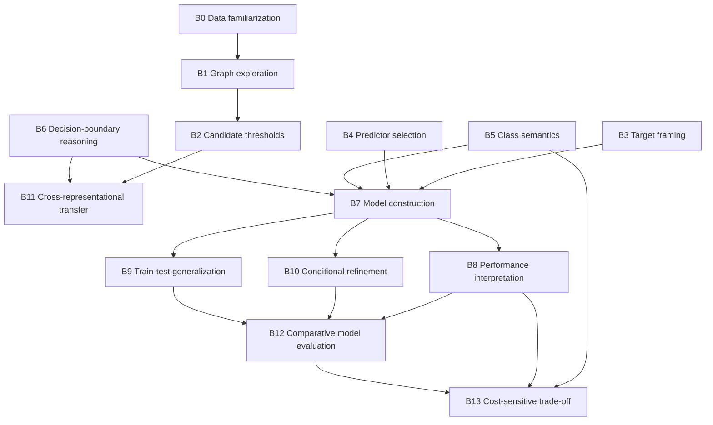

# Final Methodological Refinement of the CODAP Arbor AI-CFT Learning Analytics Rubric

**Artifact status:** Candidate codebook for expert review and empirical validation  
**Behavior set:** B0–B13 retained; no new behaviors added  
**Operational source:** `calibration/codap_rubric_v4_candidate.json`  
**Audience:** Scientific reviewers and international research partners  
**Date:** 2026-07-17

## Executive conclusion

The B0–B13 architecture can be retained, but the v3 rubric cannot be treated as a validated measurement instrument. Its principal defect is not behavior coverage; it is the conflation of three analytically distinct layers:

1. **Behavior:** the cognitive learning process;
2. **Evidence:** the observable trace that supports or refutes the behavior;
3. **Metadata:** timing, counts, sequences, modality availability, and recording quality.

The v4 candidate repairs that distinction, changes the unit of analysis from isolated frames to meaningful episodes, replaces missing-evidence zeros with `not_measurable`, removes interface-state triggers, and aligns the behaviors to the official UNESCO AI-CFT outcomes. It also corrects a substantive framework error: in the official AI-CFT, the 3.3 block is **Create**, not Deepen. Routine construction and evaluation of a decision tree in Arbor provide Acquire/Deepen evidence; they do not independently demonstrate Create.

The refined codebook is theoretically defensible and machine-readable. It is **not yet publication-ready as a validated instrument** because no expert CVI study and no independently double-coded B0–B13 sample exist. The final verdict is therefore **C — Moderate revision required**, with the remaining revision being empirical rather than another redesign of the behavior set.

## Scope boundary

The v4 B0-B13 rubric is a **construct rubric**, not a total video-analytics framework. It can validly score AI-CFT-aligned cognitive behaviors, but it does **not** fully analyze everything that screen video makes visible. In particular, the following are outside the scoring scope of B0-B13 unless they are explicitly tied to a construct criterion:

- iteration quality (systematic versus chaotic parameter search);
- cognitive-load indicators (hesitation, panel cycling, visible disorientation);
- error-recovery style (productive recovery versus repeated dead-end loops);
- help-seeking and peer/teacher dependence as process features;
- engagement/disengagement patterns and off-task drift;
- domain-specific misconception traces such as "optimize until MCR = 0";
- video-only negative evidence such as "emit occurred but no metric inspection followed."

These traces remain highly valuable, but they should be modeled in a **parallel video-process layer** rather than forced into B0-B13. The methodological recommendation of this revision is therefore a two-layer architecture:

1. **Construct layer:** B0-B13 for scored cognitive behaviors aligned to UNESCO AI-CFT.
2. **Process layer:** video-derived process indicators and codes for strategy, engagement, error recovery, help-seeking, and misconception patterns.

The construct layer answers **what AI-related reasoning was demonstrated**. The process layer answers **how the learner worked on screen**. Keeping the layers separate follows evidence-centered design, reduces construct contamination, and matches ILSA process-data practice in which clickstream/video indicators are analyzed alongside, not inside, the scored proficiency rubric.

---

# Gate artifacts and scope of claims

## Gate 0 — Single claim

> B0–B13 can be coded as AI-CFT-aligned cognitive behaviors, distinct from interface actions and process metadata, with reliability and reproducibility sufficient for human and LLM coding.

## Gate 0.5 — Audience

The leading audience is the scientific reviewer. The report therefore leads with falsifiability, construct boundaries, evidence limitations, and unvalidated claims; implementation details are retained in appendices.

## Gate 1 — Falsification plan

| Observation | Conclusion |
|---|---|
| Every behavior is defensible as a cognitive construct; every I-CVI ≥ .78; S-CVI/Ave ≥ .90; per-behavior κ and ordinal α ≥ .80; human–LLM macro-F1 ≥ .80 | The claim is supported for the validated population, tasks, and modalities. |
| Any behavior remains an interface action after revision, or expert relevance/clarity falls below the threshold | The construct specification is rejected or must be narrowed. |
| Human agreement is below .80 after calibration | The operational definitions are not sufficiently deterministic. |
| Human agreement is adequate but human–LLM macro-F1 is below .80 | The codebook may support human coding but not automated coding. |
| No adequate positive cases, no modality coverage, no expert CVI, or no independent double coding | Reliability/validity is unanswerable; no publication-level measurement claim is permitted. |

## Gate 2 — Data sanity

The repository contains substantial worksheets, recordings, transcripts, logs, and derived frames. However:

- there is no expert content-validity dataset for B0–B13;
- there is no independent human double-coded B0–B13 sample;
- the existing human reference is worksheet-focused and does not validate video behaviors;
- current non-mock scoring uses an obsolete behavior set;
- CODAP video/log synchronization coverage has known gaps;
- transcript availability is structurally unequal across sessions;
- current runtime code contains schema and prompt drift.

Therefore, this report supports a **documentary and theoretical refinement**, not empirical validity, IRR, or LLM-performance claims.

---

# Task 1 — Construct audit of B0–B13

| ID | v3 construct status | Final judgment |
|---|---|---|
| B0 | Interface proxy | An open table is software state. Retain only as active data familiarization linked to a data observation or decision. |
| B1 | Interface proxy | Graph creation is an action. Retain as graph-based exploration that produces or applies a pattern. |
| B2 | Interface proxy | A movable line is a control. Retain as deliberate candidate-boundary exploration. |
| B3 | Mixed | Target selection can evidence problem framing, but a populated target field cannot. |
| B4 | Mixed | Predictor choice is construct-relevant only when connected to a data-, domain-, or performance-based rationale. |
| B5 | Mixed | Visible labels are state; class semantics and positive-class framing are cognitive constructs. |
| B6 | Mixed | A threshold is a parameter state; partition reasoning and evidence-based refinement are cognitive constructs. |
| B7 | Interface proxy | Emit/tree visibility is execution state. Retain as coherent model construction and output-driven reconfiguration. |
| B8 | Genuine construct, invalid trigger | Performance interpretation is cognitive, but metric visibility does not show interpretation. |
| B9 | Genuine construct, invalid trigger | Generalization reasoning is cognitive, but two datasets or a switch do not establish it. |
| B10 | Interface proxy | Tree depth is metadata. Retain as conditional subgroup refinement and complexity reasoning. |
| B11 | Genuine construct, weak inference | Cross-representational transfer is cognitive; numerical co-occurrence alone is not proof. |
| B12 | Interface proxy | CTR accumulation/deletion is software use. Retain as comparative model evaluation and selection. |
| B13 | Genuine construct, lexical proxy | Cost-sensitive trade-off reasoning is cognitive; mentioning “sensitivity” or “MCR” is not. |

**Panel decision:** retain all IDs, revise all operational definitions, rename the behaviors in construct-centered language, and treat interface events only as evidence.

---

# Task 2 — Final B0–B13 codebook

## Global coding architecture

- **Unit of analysis:** a meaningful episode, not an isolated frame.
- **Default automatic episode window:** at least 30 seconds before and 20 seconds after an anchor event, extended to the next meaningful action.
- **Decision states:** `observed`, `not_observed`, `not_measurable`.
- **Level:** `Acquire`, `Deepen`, or `null`. A zero is used only when an assessable behavior was not observed.
- **Confidence:** High, Medium, or Low; confidence never changes the level.
- **Create:** Arbor operation alone does not satisfy official AI-CFT Create. Create is therefore “Not applicable” for B0–B13 in this CODAP codebook.
- **Higher-level rule:** Deepen inherits and requires Acquire unless explicitly noted.
- **Outcome rule:** accuracy improvement may corroborate a strategy but never proves reasoning.

---

## B0

**Behavior ID**  
B0

**Behavior Name**  
Data Familiarization and Variable Appraisal

**Purpose**  
Identify task-relevant properties of the dataset before or during model construction.

**Theoretical Construct**  
Data sensemaking and variable awareness.

**Operational Definition**  
Code B0 when the learner actively inspects the dataset and produces or uses at least one correct observation about a variable’s role, type, values, range, distribution, missingness, or class balance.

**Acquire Criteria**
- Active inspection of at least one variable or case is observable.
- A correct data-relevant observation is expressed or used in the connected modeling decision.

**Deepen Criteria**
- Two or more variables, distributions, or data-quality properties are compared.
- The comparison is explicitly connected to target, predictor, threshold, or evaluation strategy.

**Create Criteria**  
Not applicable.

**Observable Evidence**
- **Worksheet Evidence:** correct description of variable type, range, distribution, class balance, or data quality; a comparison used to motivate a model decision.
- **Video Evidence:** purposeful scrolling, sorting, column selection, or case inspection followed by a connected statement or action.
- **Transcript Evidence:** specific, accurate statement about dataset content or variable properties.
- **Log Evidence:** data-context/case-selection events delimit the episode but cannot establish B0 alone.

**Video Evidence Indicators**
- Table revisited before model choice.
- Cursor tracks values within a named column.
- Graph or table consulted before target/predictor selection.

**Exclusion Rules**
- Table merely open or already visible.
- Scrolling without identifiable task connection.
- Generic “I looked at the data” statement without a data observation.

**Common Coding Errors**
- Scoring software readiness as familiarization.
- Treating dwell time as attention.
- Inferring a data observation from a later correct model.

**Relation to Other Behaviors**  
B0 can support B1, B3, and B4, but equivalent worksheet evidence may make B0 unnecessary as a prerequisite.

**LLM Coding Notes**  
Require an explicit data observation or an inspection-to-decision link. Table state alone is `not_observed`. Dwell duration is metadata.

**Confidence Level**
- **High:** specific correct observation plus a connected action in another modality.
- **Medium:** specific correct observation in one complete modality.
- **Low:** inspection is visible but cognitive purpose is indirect.

---

## B1

**Behavior ID**  
B1

**Behavior Name**  
Graph-Based Data Exploration

**Purpose**  
Use a graph as an epistemic representation to examine patterns relevant to classification.

**Theoretical Construct**  
Visual and representational reasoning.

**Operational Definition**  
Code B1 when the learner intentionally constructs, changes, or revisits a graph and extracts or applies a pattern from it to the classification task.

**Acquire Criteria**
- A task-relevant graph is intentionally configured or examined.
- At least one pattern, separation, cluster, or relation is stated or used in a connected decision.

**Deepen Criteria**
- Graphs or axis-variable configurations are compared.
- The comparison justifies predictor/threshold selection, rejection, or refinement.

**Create Criteria**  
Not applicable.

**Observable Evidence**
- **Worksheet Evidence:** graph interpretation linked to a variable or split.
- **Video Evidence:** axis change, graph comparison, or graph revisit followed by a model decision.
- **Transcript Evidence:** specific interpretation of a plotted pattern or separation.
- **Log Evidence:** component creation/change identifies candidate episodes only.

**Video Evidence Indicators**
- Graph revisited before split.
- Cursor traces clusters or a boundary.
- Axis variable changed.
- Two graph panels compared.

**Exclusion Rules**
- Graph merely visible.
- Default graph accepted without examination.
- Graph creation followed by unrelated activity.

**Common Coding Errors**
- Equating graph creation with interpretation.
- Confusing a movable value with a tree threshold.
- Using graph count as a score.

**Relation to Other Behaviors**  
B1 may lead to B2, B4, or B11. It does not imply B11 without transfer evidence.

**LLM Coding Notes**  
Require a graph-to-meaning or graph-to-decision link. Multiple panels alone do not establish comparison.

**Confidence Level**
- **High:** pattern is named and immediately used.
- **Medium:** purposeful comparison is visible without explanation.
- **Low:** only a revisit/cursor trace suggests examination.

---

## B2

**Behavior ID**  
B2

**Behavior Name**  
Candidate Threshold Exploration

**Purpose**  
Generate and examine plausible decision boundaries before committing a tree split.

**Theoretical Construct**  
Hypothesis generation and threshold reasoning.

**Operational Definition**  
Code B2 when the learner deliberately places or changes a graph movable value and examines how the candidate boundary partitions cases.

**Acquire Criteria**
- A movable value is deliberately placed or changed on a relevant graph.
- The resulting partition is inspected, described, or used as a candidate split.

**Deepen Criteria**
- At least two candidate values are compared using separation, errors, or model consequences.
- The retained/rejected candidate is justified by that comparison.

**Create Criteria**  
Not applicable.

**Observable Evidence**
- **Worksheet Evidence:** candidate thresholds and their partitions/errors.
- **Video Evidence:** movable value repositioned with subsequent inspection.
- **Transcript Evidence:** reason for trying, retaining, or rejecting a candidate.
- **Log Evidence:** graph events delimit the episode; committed tree changes belong to B6.

**Video Evidence Indicators**
- Pause before moving boundary.
- Boundary moved and graph reread.
- Cases near the boundary inspected.

**Exclusion Rules**
- Default movable value with no learner interaction.
- Accidental drag.
- Repeated movement without examined consequences.

**Common Coding Errors**
- Scoring the visual line itself.
- Treating movement count as Deepen.
- Confusing candidate exploration with committed split reasoning.

**Relation to Other Behaviors**  
B2 may support B6. B11 requires coordinated evidence from B2 and B6.

**LLM Coding Notes**  
Deepen requires evaluative comparison, not two logged values. Distinguish graph and tree controls.

**Confidence Level**
- **High:** alternative values and partition consequences are explicit.
- **Medium:** deliberate movement and inspection are visible.
- **Low:** one movement is captured and purpose is ambiguous.

---

## B3

**Behavior ID**  
B3

**Behavior Name**  
Prediction-Target Framing

**Purpose**  
Formulate what the decision tree is intended to predict.

**Theoretical Construct**  
Problem framing and target–predictor distinction.

**Operational Definition**  
Code B3 when the learner intentionally identifies/selects the dependent variable and treats it as the prediction outcome rather than as a predictor.

**Acquire Criteria**
- Selected target is consistent with the task.
- Evidence shows intentional selection or accurate target–predictor distinction.

**Deepen Criteria**
- An alternative target is evaluated or a target is changed/reaffirmed.
- Final choice is justified by the prediction question or interpretive consequences.

**Create Criteria**  
Not applicable.

**Observable Evidence**
- **Worksheet Evidence:** prediction question and target stated consistently.
- **Video Evidence:** target deliberately dragged/changed after task or data inspection.
- **Transcript Evidence:** statement of what is predicted and why.
- **Log Evidence:** `set_dependent_variable` is supporting only because it may fire automatically.

**Video Evidence Indicators**
- Prompt revisited before target choice.
- Target corrected after mismatch.
- Predictor list inspected before selection.

**Exclusion Rules**
- Target preloaded or present at recording start.
- Automatic target event.
- Correct target inferred only from final model.

**Common Coding Errors**
- Treating a populated field as intentional framing.
- Scoring a target change as Deepen without rationale.
- Confusing target with positive-class definition.

**Relation to Other Behaviors**  
B3 precedes coherent B7; B5 specifies the class semantics of the target.

**LLM Coding Notes**  
Prefer worksheet/transcript or a visible selection sequence. State-only evidence is insufficient when provenance is unknown.

**Confidence Level**
- **High:** intentional selection plus accurate prediction framing.
- **Medium:** intentional selection without explanation.
- **Low:** indirect provenance only.

---

## B4

**Behavior ID**  
B4

**Behavior Name**  
Strategic Predictor Selection

**Purpose**  
Choose predictors on the basis of data, domain, or model evidence.

**Theoretical Construct**  
Strategic variable selection.

**Operational Definition**  
Code B4 when the learner selects a predictor and evidence connects the choice to a plausible relationship with the target, observed pattern, or prior model performance.

**Acquire Criteria**
- Predictor is intentionally selected.
- A plausible data-, domain-, or task-based basis is observable.

**Deepen Criteria**
- At least two predictors are compared or one is replaced.
- Choice/replacement is justified using separation, errors, or performance.

**Create Criteria**  
Not applicable.

**Observable Evidence**
- **Worksheet Evidence:** predictor choice with data/domain rationale.
- **Video Evidence:** table/graph/output consulted before selection or replacement.
- **Transcript Evidence:** specific rationale linking predictor to target/outcome.
- **Log Evidence:** `drop_attribute` sequence locates choices but does not prove strategy.

**Video Evidence Indicators**
- Data consulted before drag.
- Feature replaced after output review.
- Alternatives compared.

**Exclusion Rules**
- Random or teacher-directed drag with no ownership evidence.
- Domain relevance treated as automatically strategic.
- Feature count used as level evidence.

**Common Coding Errors**
- Rewarding any plausible feature.
- Inferring rationale from accuracy improvement.
- Conflating predictor and target selection.

**Relation to Other Behaviors**  
B4 can use B0/B1 evidence and contributes to B7/B10; B1 is not mandatory.

**LLM Coding Notes**  
If only a feature name appears in a split, do not infer strategic selection. Extract alternatives, evidence, and criterion.

**Confidence Level**
- **High:** explicit rationale plus connected selection.
- **Medium:** clear inspection-to-selection sequence.
- **Low:** choice appears purposeful but rationale is unavailable.

---

## B5

**Behavior ID**  
B5

**Behavior Name**  
Class Semantics and Positive-Class Framing

**Purpose**  
Define the meaning of model outcomes and the positive class in context.

**Theoretical Construct**  
Classification concept formation and semantic framing.

**Operational Definition**  
Code B5 when the learner defines or correctly applies the two outcome classes and the positive class consistently with the task.

**Acquire Criteria**
- Both class meanings are correctly identified/applied.
- Positive class is distinguishable from desirability or moral value.

**Deepen Criteria**
- Learner explains how class framing changes TP/TN/FP/FN interpretation or consequences.
- Alternative positive-class choices are evaluated when relevant.

**Create Criteria**  
Not applicable.

**Observable Evidence**
- **Worksheet Evidence:** class labels, positive-class definition, and confusion-matrix semantics.
- **Video Evidence:** prediction labels deliberately assigned or corrected.
- **Transcript Evidence:** statement of class meaning/positive outcome.
- **Log Evidence:** assignment events show action; semantics require another source.

**Video Evidence Indicators**
- Leaf labels checked after assignment.
- Prediction reversed after noticing meaning.
- Matrix consulted after assignment.

**Exclusion Rules**
- Default labels merely visible.
- Two labels present with no authorship/interpretation.
- “Positive” assumed to mean beneficial.

**Common Coding Errors**
- Scoring context-appropriate text without provenance.
- Conflating class definition with target selection.
- Inferring matrix understanding from valid labels.

**Relation to Other Behaviors**  
B5 specifies B3 target semantics and is needed for defensible B8/B13 interpretation.

**LLM Coding Notes**  
Resolve positive class before metric interpretation. Visible labels alone are evidence availability, not behavior.

**Confidence Level**
- **High:** class/positive-class meaning explicit and correctly used.
- **Medium:** deliberate assignment/correction visible.
- **Low:** only contextual label consistency is available.

---

## B6

**Behavior ID**  
B6

**Behavior Name**  
Decision-Boundary Reasoning

**Purpose**  
Select and refine a split boundary according to partition and classification consequences.

**Theoretical Construct**  
Quantitative threshold reasoning and iterative optimization.

**Operational Definition**  
Code B6 when the learner applies a numeric/categorical split and accurately relates it to branch membership or resulting errors.

**Acquire Criteria**
- Committed split is learner-produced.
- Learner accurately identifies/uses how it partitions cases.

**Deepen Criteria**
- Alternative splits are compared using partition quality, errors, or evaluation.
- Selected split is retained/rejected/revised with evidence-based rationale.

**Create Criteria**  
Not applicable.

**Observable Evidence**
- **Worksheet Evidence:** correct split rule/partition and threshold comparison.
- **Video Evidence:** split changed after graph/data/output review and branches inspected.
- **Transcript Evidence:** explanation of separation or error consequences.
- **Log Evidence:** value sequence supports chronology but not reasoning.

**Video Evidence Indicators**
- Branch memberships inspected.
- Threshold revised after error review.
- Near-boundary cases checked.
- Graph consulted before split.

**Exclusion Rules**
- Threshold merely visible.
- Random numeric changes.
- A different value alone treated as iteration.
- Movable value without tree application.

**Common Coding Errors**
- Using change count as Deepen.
- Conflating B2 with B6.
- Using improved accuracy as proof.

**Relation to Other Behaviors**  
B6 may follow B2; B11 requires their coordination. B6 contributes to B7/B10.

**LLM Coding Notes**  
Require partition interpretation or evidence-based evaluation. If multiple elements change simultaneously, do not attribute the effect to threshold alone.

**Confidence Level**
- **High:** split consequences and rationale explicit.
- **Medium:** inspection-to-revision sequence complete.
- **Low:** purposeful split visible but interpretation incomplete.

---

## B7

**Behavior ID**  
B7

**Behavior Name**  
Coherent Model Construction and Execution

**Purpose**  
Integrate target, predictors, splits, and predictions into an executable classification model.

**Theoretical Construct**  
Procedural integration and model construction.

**Operational Definition**  
Code B7 when the learner assembles and executes a valid decision tree whose target, split structure, and leaf predictions form a coherent response to the task.

**Acquire Criteria**
- Learner authorship or meaningful modification is observable.
- Executed tree is structurally valid and task-consistent.

**Deepen Criteria**
- Learner reviews an output and deliberately rebuilds/reruns a changed configuration.
- Revision is connected to a diagnosed issue or explicit goal.

**Create Criteria**  
Not applicable.

**Observable Evidence**
- **Worksheet Evidence:** coherent tree or rule set constructed for the task.
- **Video Evidence:** target, split, predictions, and emit assembled; output-driven rebuild.
- **Transcript Evidence:** model plan or reason for rerunning/rebuilding.
- **Log Evidence:** ordered target/drop/split/emit events corroborate authorship and revision.

**Video Evidence Indicators**
- Tree assembled incrementally.
- Leaf predictions checked.
- Output read before rebuild.
- Reset followed by targeted reconstruction.

**Exclusion Rules**
- Tree already present at recording start.
- Copied tree run without meaningful modification/explanation.
- Emit click alone.
- Depth 2 alone treated as Deepen.

**Common Coding Errors**
- Equating visibility with construction.
- Counting repeated emits as refinement.
- Rewarding structurally invalid but complex trees.

**Relation to Other Behaviors**  
B7 integrates B3–B6. B10 is local conditional refinement; B8 evaluates B7 output.

**LLM Coding Notes**  
Reconstruct `configuration₁ → output₁ → evidence consulted → configuration₂ → output₂`. Do not infer authorship/intention from a final frame.

**Confidence Level**
- **High:** complete construction sequence and valid output.
- **Medium:** meaningful modification and execution visible.
- **Low:** partial provenance only.

---

## B8

**Behavior ID**  
B8

**Behavior Name**  
Model-Performance Interpretation

**Purpose**  
Draw an accurate claim about model quality from valid evaluation output.

**Theoretical Construct**  
Reflective evaluation and statistical interpretation.

**Operational Definition**  
Code B8 when the learner accurately interprets at least one valid performance measure and connects it to model quality, an error pattern, or a next decision.

**Acquire Criteria**
- A valid metric or confusion-matrix quantity is accurately interpreted.
- Interpretation refers to the learner’s model rather than merely reading a label/number.

**Deepen Criteria**
- At least two complementary measures/error types are integrated, or two models are compared.
- Interpretation motivates a justified model decision or limitation claim.

**Create Criteria**  
Not applicable.

**Observable Evidence**
- **Worksheet Evidence:** accurate interpretation of accuracy, matrix, sensitivity, or MCR.
- **Video Evidence:** metric panel actively inspected before a connected decision.
- **Transcript Evidence:** specific metric/error interpretation tied to the model.
- **Log Evidence:** valid values are factual referents only.

**Video Evidence Indicators**
- Scroll to confusion matrix.
- Cursor compares FP/FN.
- Post-emit active reading followed by targeted change.

**Exclusion Rules**
- Metric merely visible.
- Number read without interpretation.
- All-zero matrix with `no prediction=N`.
- Accuracy improvement treated as interpretation.

**Common Coding Errors**
- Scoring output visibility.
- Treating post-emit delay as reading.
- Equating general evaluation with B13 trade-off reasoning.

**Relation to Other Behaviors**  
B8 requires valid B7 output, supports B12, and never automatically implies B13.

**LLM Coding Notes**  
Extract `metric/value → meaning → judgment/action`; verify class polarity and displayed values.

**Confidence Level**
- **High:** specific accurate interpretation plus connected decision.
- **Medium:** accurate interpretation in one semantic source.
- **Low:** inspection suggests interpretation but semantics are absent.

---

## B9

**Behavior ID**  
B9

**Behavior Name**  
Training–Test Generalization Reasoning

**Purpose**  
Use training data for construction and held-out data for estimating generalization.

**Theoretical Construct**  
Generalization reasoning and validation awareness.

**Operational Definition**  
Code B9 when the learner correctly distinguishes training and test roles and uses held-out performance to evaluate a model without treating test data as additional training evidence.

**Acquire Criteria**
- Training and test roles are correctly identified.
- Model is built on training data and evaluated on held-out data.

**Deepen Criteria**
- Training and test outcomes are compared.
- Learner makes an accurate claim about generalization, overfitting, or selection without tuning on test data.

**Create Criteria**  
Not applicable.

**Observable Evidence**
- **Worksheet Evidence:** correct distinction/comparison of training and test results.
- **Video Evidence:** purposeful switch in correct sequence with output comparison.
- **Transcript Evidence:** explanation of held-out evaluation or gap.
- **Log Evidence:** switch/emit sequence establishes order, not conceptual distinction.

**Video Evidence Indicators**
- Training output recorded before test switch.
- Test result inspected without rebuilding on test.
- Return to training after diagnosing generalization.

**Exclusion Rules**
- Two names merely visible.
- Accidental switch.
- Test-tuned result reported as unbiased.
- No train/test opportunity: `not_measurable`, not zero.

**Common Coding Errors**
- Scoring Choosy visibility.
- Assuming roles from ambiguous names.
- Calling any gap “overfitting.”

**Relation to Other Behaviors**  
B9 requires B7 and enables stronger B8 evaluation.

**LLM Coding Notes**  
Verify dataset identity, chronology, initial model preservation, and interpretation. If identity is ambiguous, code `not_measurable`.

**Confidence Level**
- **High:** correct sequence and explicit generalization claim.
- **Medium:** correct sequence without explanation.
- **Low:** dataset labels/coverage ambiguous.

---

## B10

**Behavior ID**  
B10

**Behavior Name**  
Conditional Model Refinement

**Purpose**  
Refine a heterogeneous subgroup with an additional split while managing complexity.

**Theoretical Construct**  
Conditional reasoning and model-complexity management.

**Operational Definition**  
Code B10 when the learner adds or revises a child split to address a specific subgroup, residual error pattern, or conditional relationship.

**Acquire Criteria**
- A child-node split is learner-produced.
- Evidence identifies the subgroup/local problem addressed.

**Deepen Criteria**
- Alternative child splits/depths are compared.
- Refinement is justified using local errors, gain, interpretability, or overfitting risk.

**Create Criteria**  
Not applicable.

**Observable Evidence**
- **Worksheet Evidence:** valid multi-level tree with conditional rationale.
- **Video Evidence:** child node inspected and split after subgroup/output review.
- **Transcript Evidence:** explanation of why a branch needs further division.
- **Log Evidence:** node-specific events and depth support chronology only.

**Video Evidence Indicators**
- Focus on impure leaf.
- Child split revised.
- Tree pruned/simplified after comparison.

**Exclusion Rules**
- Depth-2 tree merely visible.
- Extra splits without subgroup rationale.
- Complexity treated as automatically better.

**Common Coding Errors**
- Equating depth with level.
- Duplicating B7.
- Using accuracy gain alone as rationale.

**Relation to Other Behaviors**  
B10 is a local elaboration of B7 and may be evaluated through B8/B12.

**LLM Coding Notes**  
Require subgroup-targeted diagnosis. Parse root-to-leaf conditions; depth metadata never triggers B10.

**Confidence Level**
- **High:** subgroup diagnosis, child split, and evaluation observed.
- **Medium:** targeted child-split sequence clear.
- **Low:** only local focus/split visible.

---

## B11

**Behavior ID**  
B11

**Behavior Name**  
Cross-Representational Threshold Coordination

**Purpose**  
Coordinate a graphical boundary with a tree split and evaluate their correspondence.

**Theoretical Construct**  
Representational fluency and transfer.

**Operational Definition**  
Code B11 when the learner intentionally transfers or reconciles a threshold for the same variable between a graph and the tree.

**Acquire Criteria**
- Graph and tree use the same variable.
- Values match within display precision, and temporal/semantic evidence supports transfer.

**Deepen Criteria**
- Transfer is repeated for another variable or revised after checking consequences.
- Learner explains agreement, rounding, or deliberate discrepancy.

**Create Criteria**  
Not applicable.

**Observable Evidence**
- **Worksheet Evidence:** graph-derived threshold explicitly applied to a rule.
- **Video Evidence:** graph read immediately before matching tree entry; representations revisited.
- **Transcript Evidence:** explicit transfer statement.
- **Log Evidence:** temporal proximity supports but never proves transfer.

**Video Evidence Indicators**
- Alternation between graph and tree.
- Value read then entered.
- Rounding checked.
- Result used to revisit graph.

**Exclusion Rules**
- B2+B6 co-occur without transfer evidence.
- Coincidental numeric match.
- Different variables/units.
- Approximation outside display precision.

**Common Coding Errors**
- Treating equality as intent.
- Ignoring variable identity/units.
- Automatically double-counting B2 and B6.

**Relation to Other Behaviors**  
B11 depends on B2 and B6 evidence but is a distinct coordination construct.

**LLM Coding Notes**  
Verify variable, units, tolerance, and temporal/semantic linkage. Missing any element means no B11.

**Confidence Level**
- **High:** explicit statement or read–enter–verify sequence.
- **Medium:** matching sequence and value.
- **Low:** approximate co-occurrence only.

---

## B12

**Behavior ID**  
B12

**Behavior Name**  
Comparative Model Evaluation and Record Use

**Purpose**  
Use retained model records to compare alternatives and make an evidence-based selection.

**Theoretical Construct**  
Comparative evaluation and metacognitive monitoring.

**Operational Definition**  
Code B12 when the learner uses at least two retained model records to compare configurations/outcomes according to an explicit criterion.

**Acquire Criteria**
- At least two valid records are identified as alternatives.
- Comparison on at least one relevant criterion is observable.

**Deepen Criteria**
- Multiple criteria, error costs, generalization, or complexity are integrated.
- Model is selected/rejected/retained with evidence-based justification.

**Create Criteria**  
Not applicable.

**Observable Evidence**
- **Worksheet Evidence:** multiple-model comparison and selection rationale.
- **Video Evidence:** rows deliberately selected/revisited/compared.
- **Transcript Evidence:** specific comparison and selection claim.
- **Log Evidence:** emit/row interactions establish opportunity only.

**Video Evidence Indicators**
- Alternating row selection.
- Parameters and metrics compared.
- Inferior record deleted after articulated criterion.

**Exclusion Rules**
- Rows merely accumulated.
- Deletion without evaluation.
- Latest model assumed preferred.
- Emit count used as score.

**Common Coding Errors**
- Scoring CTR housekeeping.
- Inferring comparison from visibility.
- Conflating B8 interpretation with B12 selection.

**Relation to Other Behaviors**  
B12 requires multiple B7 outputs and basic B8 interpretation; B13 may supply a criterion.

**LLM Coding Notes**  
Alternatives, common criterion, and comparison are all required.

**Confidence Level**
- **High:** alternatives, criterion, and justified selection explicit.
- **Medium:** direct comparison visible without final selection.
- **Low:** navigation suggests comparison, semantics incomplete.

---

## B13

**Behavior ID**  
B13

**Behavior Name**  
Cost-Sensitive Metric Trade-Off Reasoning

**Purpose**  
Evaluate model errors according to context-dependent consequences rather than accuracy alone.

**Theoretical Construct**  
Cost-sensitive evaluation and contextual judgment.

**Operational Definition**  
Code B13 when the learner accurately interprets sensitivity, MCR, FP, or FN and uses contextual error consequences to compare or prioritize model outcomes.

**Acquire Criteria**
- At least one relevant metric/error type is accurately interpreted.
- Interpretation identifies represented cases/errors.

**Deepen Criteria**
- Sensitivity–MCR or FP–FN consequence trade-off is explicitly evaluated.
- Priority/model choice is justified by application context.

**Create Criteria**  
Not applicable.

**Observable Evidence**
- **Worksheet Evidence:** correct calculation/interpretation and contextual trade-off explanation.
- **Video Evidence:** outputs inspected before contextual decision; video alone rarely suffices.
- **Transcript Evidence:** explicit interpretation and prioritization.
- **Log Evidence:** values support checking but cannot establish reasoning.

**Video Evidence Indicators**
- Sensitivity/MCR fields compared.
- FP/FN cells revisited.
- Two records inspected before contextual choice.

**Exclusion Rules**
- Metric term merely mentioned.
- Formula recited without interpretation.
- Accuracy-only comparison.
- Missing semantic source coded as zero instead of `not_measurable`.

**Common Coding Errors**
- Treating vocabulary as reasoning.
- Inferring cost sensitivity from low FN.
- Mapping evaluation to UNESCO Create.

**Relation to Other Behaviors**  
B13 presupposes B5 and B8; B8 never implies B13.

**LLM Coding Notes**  
Require `metric meaning → contextual consequence → priority/choice`. If transcript and worksheet semantic evidence are unavailable, return `not_measurable`.

**Confidence Level**
- **High:** accurate meaning plus explicit contextual trade-off.
- **Medium:** accurate contextual interpretation in one semantic source.
- **Low:** inspection only, without complete trade-off.

---

# Task 3 — Video Evidence Appendix

The following indicators improve evidential confidence but receive no score.

| Behavior | Non-scored video indicators |
|---|---|
| B0 | table scrolling/resizing; column tracing; return to data before a decision |
| B1 | axis inspection/change; cluster tracing; graph comparison/revisit |
| B2 | pause at candidate values; boundary adjustment followed by rereading; near-boundary inspection |
| B3 | task prompt reread; deliberate target drag; correction of target/predictor reversal |
| B4 | data/graph consultation before drag; targeted predictor replacement after output |
| B5 | leaf composition checked; labels corrected; matrix inspected after polarity assignment |
| B6 | branch memberships checked; threshold revised after error review; graph consulted |
| B7 | incremental construction; predictions checked; output read before rebuild |
| B8 | scroll to matrix; cursor compares cells; targeted post-emit correction |
| B9 | dataset identity checked; training output retained; unchanged model applied to test |
| B10 | impure leaf selected; child split changed; complexity added/reverted after review |
| B11 | graph–tree alternation; value read then entered; rounding verified |
| B12 | alternating rows; common fields compared; dominated model removed after evaluation |
| B13 | metric/error cells compared; context-specific decision follows output inspection |

**Prohibition:** pauses, cursor movement, number of clicks, and time on screen are never behavior scores. They only qualify confidence and episode interpretation.

---

# Task 4 — Process Metadata Appendix

| Variable | Operational definition | Why useful | Why never scored |
|---|---|---|---|
| `time_to_first_target_ms` | session start to first attributable target selection | workflow onset and usability | latency is not problem framing |
| `time_to_first_split_ms` | session start to first committed split | workflow comparison | speed is not threshold reasoning |
| `time_to_first_emit_ms` | session start to first valid emit | process description | speed is not competence |
| `feature_change_count` | number of predictor replacements | locates exploration/instability | frequency cannot show strategy |
| `unique_features_tried` | distinct predictors used | describes search breadth | breadth may be systematic or random |
| `threshold_change_count` | number of threshold changes | locates candidate episodes | changes do not show evaluation |
| `unique_thresholds_tried` | distinct values within precision | search-space description | count does not show reasoning |
| `graph_creation_count` | graph panels created | tool-use profile | creation is not interpretation |
| `graph_revisit_count` | returns to existing graph | potential cross-representation episodes | revisiting does not prove use |
| `emit_count` | all emit events | candidate model opportunities | repetition is not refinement |
| `valid_emit_count` | emits with valid predictions | output opportunity | validity of output is not interpretation |
| `depth2_attempts` | valid depth ≥2 model attempts | locates B10 episodes | depth is structural metadata |
| `max_tree_depth` | maximum observed depth | complexity description | complexity is not quality |
| `tree_rebuild_count` | reset followed by construction | locates revision episodes | rebuild can reproduce same model |
| `comparison_cycles` | transitions among distinct records | locates B12 opportunities | navigation is not comparison |
| `dataset_switch_count` | train/test or context switches | locates B9 episodes | switch does not show role awareness |
| `late_behavior_onset` | first qualified evidence timestamp per behavior | temporal trajectory | timing is not proficiency |
| `pause_before_model_selection_ms` | inactivity/active dwell before choice | deliberation hypothesis | pause may be distraction |
| `post_emit_gap_ms` | emit to next meaningful action | output-reading opportunity | gap does not show reading |
| `active_tree_read_ms` | focal tree interaction after output | attention evidence | attention does not prove interpretation |
| `undo_count` | undo/reversal events | error-recovery description | undo may be correction or accident |
| `instruction_revisit_count` | instruction panel reopens | self-regulation context | instruction use is not target behavior |
| `assistance_status` | independent/peer/instructor/unclear | agency qualifier | assistance is not automatic penalty |
| `off_task_duration_ms` | verified off-task interval | coverage/context | not an inverse competency score |
| `frame_coverage_ratio` | captured relevant intervals / expected intervals | evidence-quality audit | technical completeness is not performance |
| `audio_available` | usable learner audio flag | missingness stratification | modality access must not alter ability |
| `log_available` | usable event-log flag | provenance/sequence quality | missing logs are not behavior absence |
| `sync_error_ms` | estimated log–video offset/error | temporal-validity audit | technical error is not learner error |
| `duplicate_frame_ratio` | redundant frames / captured frames | extraction QA | sampling artifact is not behavior |
| `model_configuration_hash` | normalized target/features/thresholds/classes/depth | detects substantive model changes | hash difference does not prove rationale |

---

# Task 4.5 — Parallel Video-Process Layer

The repository evidence now shows that some important screen-recorded behaviors are **not construct-valid additions to B0-B13**, yet they are too important to discard. They should therefore be coded in a parallel layer, not as extra AI-CFT scores.

## Why a parallel layer is required

- The 2025 gap audit documents authentic video behaviors that B0-B13 does not fully cover (`data_sources_2025/rubric_gaps_2025.json`).
- ILSA process-data literature routinely models **engagement, navigation, timing, VOTAT-style strategy, sequence patterns, and reset behavior** as process indicators rather than as scored domain-construct criteria.
- Forcing process-only traces into B0-B13 would reintroduce the construct contamination that v4 was designed to remove.

## Recommended video-process categories

| Process category | Typical manifestations in CODAP Arbor video | Score status |
|---|---|---|
| **Systematic iteration** | one parameter changed at a time; output inspected before next change | unscored process code |
| **Chaotic iteration** | multiple controls changed without stable inspection cycle | unscored process code |
| **Cognitive-load / usability strain** | repeated panel opening, visible hesitation, search-without-progress | unscored process code |
| **Engagement / disengagement** | sustained task focus, off-task drift, long idle periods, observational passivity | unscored process code |
| **Error recovery** | reset, rebuild, correction after failure, repeated dead-end loops | unscored process code |
| **Help-seeking / social dependence** | teacher-directed action, peer-provided threshold, defended model choice after challenge | unscored process code |
| **Misconception patterns** | MCR=0 targeting, label inversion, same-class leaves, train/test misuse | unscored process code |
| **Video-only negative evidence** | no metric inspection, no graph reading, no comparison despite visible opportunity | unscored process code |

## Interpretation rule

Parallel process codes may:

- qualify confidence,
- identify learner strategy profiles,
- support mixed-method interpretation,
- become features for machine-learning models,
- inform instructional design and error analysis.

They may **not** directly raise or lower B0-B13 levels unless the trace also satisfies the explicit scored criteria of a construct behavior.

## Implementation note

The recommended operational artifact is a separate `VIDEO_PROCESS_CODEBOOK_v1` with its own schema, coder rules, and machine-readable output. Session-level analysis should report:

1. highest validated B0-B13 level per behavior; and
2. co-occurring video-process profile for the same episode/session.

---

# Task 5 — Coder Decision Rules

1. **Episode before frame:** detect evidence in frames, but code the complete meaningful episode.
2. **Minimum-supported level:** assign Deepen only when every Deepen criterion is explicit.
3. **State separation:** use `not_measurable` for unavailable opportunity/modality; use `not_observed` only when assessable.
4. **Preloaded state:** a pre-existing table, graph, tree, target, labels, metric, or CTR row cannot establish learner behavior.
5. **Same threshold but rounded:** treat values as equivalent only within the interface display precision or a preregistered tolerance; document tolerance.
6. **Copied tree:** do not score construction from a copied artifact; later meaningful modification/explanation can support the relevant behavior.
7. **Deleted tree/row:** deletion is metadata unless tied to an explicit diagnosis/comparison.
8. **Undo:** never classify undo alone as struggle, error recognition, or refinement.
9. **Partially visible graph/tree:** score only visible criteria; never reconstruct hidden elements.
10. **Hidden confusion matrix:** logged values show output availability, not learner inspection/interpretation.
11. **Missing transcript:** use worksheet or complete temporal behavior evidence where permitted; otherwise `not_measurable`, never an automatic zero.
12. **Multiple monitors/windows:** mark capture incompleteness and lower confidence; do not infer unseen actions.
13. **Fast interaction:** speed neither proves fluency nor guessing.
14. **Low frame rate/gaps:** use logs to locate events, but do not infer missing visual transitions; lower confidence or mark not measurable.
15. **Automatic target events:** `set_dependent_variable` cannot establish B3 without attributable selection.
16. **Concurrent changes:** do not attribute an outcome change to a threshold if feature, target, class polarity, dataset, or depth also changed.
17. **Metric conflict:** verify class polarity and denominators before accepting TP/FP/FN/sensitivity claims.
18. **Action–speech conflict:** visible/logged evidence determines what occurred; speech determines stated reasoning. If unresolved, code the lower defensible level and flag conflict.
19. **Assistance:** record the source; score only the performance demonstrably attributable to the learner.
20. **Session aggregation:** retain all episodes; report highest validated level, not an average or count-based score.

---

# Task 6 — Inter-rater Reliability Protocol

## Expert content validation

1. Recruit 8–12 experts spanning decision-tree/statistics education, learning sciences, AI education, educational measurement, MMLA/HCI, and qualitative coding.
2. Rate each behavior’s relevance, clarity, observability, and AI-CFT alignment on a four-point scale.
3. Pre-register **I-CVI ≥ .78 for every behavior** and **S-CVI/Ave ≥ .90**. With 6–8 experts, use the more conservative `.83` item threshold.
4. Record every revision and dissent; do not report internal consensus as CVI.

## Human coder training

1. Train coders on behavior/evidence/metadata separation and the episode unit.
2. Use positive, negative, borderline, missing-modality, and conflicting-evidence exemplars for each behavior.
3. Require independent qualification before production coding.
4. Freeze a versioned codebook after calibration; later changes require impact review and recoding.

## Pilot and sampling

- Double-code a stratified pilot covering every behavior, 0/Acquire/Deepen, cohorts, transcript conditions, and recording quality.
- Use at least 100 episodes or enough enriched episodes to secure positive examples for rare behaviors.
- Then double-code at least 20% of production sessions, stratified by cohort and modality.
- Keep an untouched validation sample; never tune coder or LLM rules on it.

## Agreement measures

- **Two coders, ordinal level:** weighted Cohen’s κ per behavior.
- **Three or more coders/missing values:** ordinal Krippendorff’s α.
- Also report exact agreement, positive/negative agreement, prevalence, confusion matrices, and bootstrap 95% CIs.
- **Strict acceptance:** per-behavior κ and α ≥ .80. Values below .80 trigger recalibration and repeat testing.
- Do not hide low-prevalence instability inside pooled coefficients.

## Adjudication

- Preserve original independent codes.
- Third coder/panel adjudicates after reliability calculation.
- Log disputed evidence, original decisions, final decision, rationale, and rule change.
- Recode all potentially affected cases when a rule changes.

## Human–LLM agreement

- Adjudicated human codes are the reference standard.
- Report per-behavior/per-level precision, recall, F1, exact agreement, severe 0↔Deepen error rate, and macro averages.
- **Strict acceptance:** macro-F1 ≥ .80, with each behavior inspected separately.
- Any below-target behavior remains human-reviewed.
- LLM–human agreement never substitutes for human–human reliability.

---

# Task 7 — LLM Coding Protocol

## Prompt hierarchy

1. Immutable system rules: construct/evidence/metadata separation, missingness, no inference.
2. Versioned B0–B13 codebook and exclusions.
3. Episode definition and source-provenance rules.
4. Input evidence: frames/video, worksheet excerpt, transcript, validated log window.
5. Non-scored metadata.
6. JSON schema.

Lower layers cannot override higher layers.

## Reasoning order

1. Verify recording quality and behavior opportunity.
2. Identify learner-attributable artifacts/actions.
3. Reconstruct temporal sequence.
4. Extract semantic claims from worksheet/transcript.
5. Check logs for chronology and numerical values.
6. Apply exclusions before positive criteria.
7. Decide `not_measurable` / `not_observed` / `observed`.
8. If observed, test Acquire, then Deepen.
9. Assign confidence independently.
10. Return evidence references, not hidden chain-of-thought.

## Precedence and conflict

- Direct learner-produced semantic evidence outranks interface-state inference.
- Validated logs outrank uncertain visual timing but do not prove cognition.
- Visible action determines what occurred; transcript/worksheet determines stated reasoning.
- When two sources remain irreconcilable, assign the lower level and emit an `evidence_conflict`.

## Missing evidence

- Never fabricate hidden content or bridge dropped frames.
- Missing required modality/opportunity → `not_measurable`.
- Assessable episode without qualifying evidence → `not_observed`.
- Missing transcript does not lower the level when criteria can be met through other direct evidence.

## Temporal aggregation

- Detect evidence per frame/event, merge adjacent observations into one episode, then code.
- Iteration/transfer/comparison requires ordered evidence.
- Session level is the highest validated episode level, with all events retained.
- Counts/durations never promote a level.

## Reproducibility controls

- Freeze model provider, exact model version, temperature, seed if available, prompt hash, schema version, image/video hashes, preprocessing version, and evidence ordering.
- Use temperature 0 and JSON schema validation.
- Run repeated stability tests on a fixed fixture set.
- Store raw model output and normalized decision separately.
- Require human review for Low confidence, conflicts, and any behavior below validation thresholds.

## Recommended JSON shape

```json
{
  "rubric_id": "codap_arbor_v4_candidate",
  "schema_version": "4.0",
  "student_id": "canonical_id",
  "session_id": "session_id",
  "episode": {
    "start_ms": 0,
    "end_ms": 0,
    "anchor_event": "emit_tree_data",
    "opportunity": true,
    "modalities_available": ["video", "worksheet", "transcript", "log"]
  },
  "behaviors": {
    "B0": {
      "decision": "observed",
      "level": "Acquire",
      "confidence": "high",
      "criteria_met": ["B0-A1", "B0-A2"],
      "evidence": [
        {
          "source": "video",
          "frame_id": "frame_0012",
          "start_ms": 12000,
          "end_ms": 18000,
          "observation": "Inspected salt column and then selected salt."
        }
      ],
      "exclusions_checked": ["preloaded_state"],
      "uncertainty_reason": null
    }
  },
  "evidence_conflicts": [],
  "process_metadata_ref": "session_metadata.json",
  "model_provenance": {
    "provider": "provider",
    "model": "exact-version",
    "prompt_sha256": "hash",
    "temperature": 0
  }
}
```

---

# Task 8 — Behavior Dependency Map



Arrows are typical evidential dependencies, not mandatory developmental stages. Key safeguards:

- B2 and B6 do not imply B11; transfer evidence is required.
- B7 does not imply B10; local conditional rationale is required.
- B8 does not imply B12 or B13.
- B9 is a generalization branch, not a prerequisite for every evaluation.

---

# Task 9 — AI-CFT Alignment

The official UNESCO blocks are:

- **3.1 Acquire — Basic AI techniques and applications**
- **3.2 Deepen — Application skills**
- **3.3 Create — Creating with AI**

The current v3 use of “LO3.3 = Deepen” is invalid. Exact outcome IDs must replace coarse labels.

| Behavior | Acquire alignment | Deepen alignment | Create | Justification | Main evidence |
|---|---|---|---|---|---|
| B0 | LO3.1.1 | LO3.2.3 supporting | N/A | data/algorithm awareness and data-grounded application | worksheet, video, transcript |
| B1 | LO3.1.1 | LO3.2.2 | N/A | visual representation of data/model-relevant patterns | video, worksheet |
| B2 | LO3.1.1 supporting | LO3.2.3 | N/A | candidate boundary exploration | video, worksheet |
| B3 | LO3.1.1 | — | N/A | problem-scoping and prediction target | worksheet, video, transcript |
| B4 | — | LO3.2.3 | N/A | evidence-based predictor application | all four sources |
| B5 | LO3.1.1 | LO3.2.3 supporting | N/A | class/label and error semantics | worksheet, transcript, video |
| B6 | LO3.1.1 supporting | LO3.2.3 | N/A | data/algorithm parameter reasoning | all four sources |
| B7 | LO3.1.3 | LO3.2.1, LO3.2.3 | N/A | tool operation integrated with model construction | video, log, worksheet |
| B8 | — | LO3.2.1, LO3.2.3 | N/A | evidence-based evaluation of model behavior | worksheet, transcript, output |
| B9 | LO3.1.1 supporting | LO3.2.2, LO3.2.3 | N/A | training/testing and generalization | worksheet, video, log |
| B10 | — | LO3.2.2, LO3.2.3 | N/A | hierarchical conditional problem solving | worksheet, video, log |
| B11 | — | LO3.2.2, LO3.2.3 | N/A | coordination of visual and algorithmic representations | video, transcript, log |
| B12 | — | LO3.2.1, LO3.2.3 | N/A | compare–select–apply cycle | worksheet, video, transcript |
| B13 | — | LO3.2.1, LO3.2.3 | N/A | contextual evaluation of model limitations/errors | worksheet, transcript, output |

**Create ceiling:** none of B0–B13 independently supports LO3.3.1–LO3.3.4. Create requires customization/assembly of an AI tool or model into a locally relevant solution, systematic testing of a self-created tool, or contribution to a tailored-tool repository. Later Colab/customization tasks must carry that evidence under a separate, namespaced rubric.

---

# Task 10 — Reviewer #2 challenge and repairs

## Grounds for rejection of v3

1. **Construct contamination:** interface state is scored as cognition.
2. **Wrong unit:** isolated frames cannot establish reasoning, iteration, transfer, or comparison.
3. **AI-CFT misalignment:** LO3.3 is mislabeled as Deepen.
4. **Missingness bias:** no Choosy/audio becomes score 0.
5. **Level inflation:** v3 LO summaries trigger Deepen from score ≥1.
6. **Double counting:** B2/B6/B11; B7/B10/B12; B8/B13 treated as independent.
7. **Outcome circularity:** improved accuracy can be mistaken for strategic reasoning.
8. **No agency/provenance:** preloaded, copied, teacher-directed, and learner-authored states are conflated.
9. **No content-validity evidence:** internal mapping is not expert CVI.
10. **No IRR:** there is no independent human B0–B13 double coding.
11. **No criterion/external validity:** no relation to independent holistic or transfer performance.
12. **Runtime drift:** canonical JSON and hard-coded LLM prompt differ.
13. **Schema defect:** scorer requests `score` but reads/aggregates incompatible `triggered` fields.
14. **Unavailable temporal context:** several behaviors require prior-state fields that runtime does not retain.
15. **Prompt drift:** runtime says “10 behaviors” while requesting 14.
16. **Namespace collision:** CODAP and Colab reuse B1–B13 with different meanings.
17. **Multimodal synchronization gaps:** event coverage is not adequate for complete inference.
18. **Transcript inequity:** silent sessions have systematically weaker observability.
19. **Transferability limits:** interface-specific constructs are overgeneralized to teacher AI competency.
20. **Consequence validity:** automated AI-CFT judgments lack a human-accountability rule.

## Repairs in v4

- Construct-centered names and definitions.
- Episode-based coding.
- `not_measurable` separated from absence.
- Provenance and assistance qualifiers.
- Deterministic exclusions and precedence.
- Compound-behavior dependency rules.
- Exact UNESCO outcome crosswalk and no unsupported Create.
- CVI/IRR/human–LLM preregistration.
- Versioned JSON/provenance requirements.
- Human review for uncertainty/conflict.

## Criticisms that cannot be repaired by wording

The following require new empirical work:

- expert CVI;
- human–human IRR;
- human–LLM accuracy;
- event-alignment/coverage validation;
- convergent/discriminant evidence;
- transfer across datasets, tasks, interfaces, and cultural contexts;
- analysis of missing-modality bias.

---

# Task 11 — Publishability judgment

These ratings apply to the **v4 candidate after documentary refinement**, not to empirical performance.

| Criterion | Score / 10 | Judgment |
|---|---:|---|
| Construct validity | 8 | Construct boundaries are substantially improved; empirical discriminant evidence is absent. |
| Content validity | 8 | CODAP decision-tree workflow is well covered; expert CVI remains absent. |
| Face validity | 9 | Names, criteria, exclusions, and evidence sources are intelligible to domain reviewers. |
| Inter-rater reliability | 4 | A rigorous protocol exists, but no coefficients exist. |
| Transferability | 6 | Core constructs transfer; interface evidence and local task context remain specific. |
| Reproducibility | 7 | Candidate JSON is versioned; runtime prompt/schema drift must be repaired and tested. |
| LLM compatibility | 8 | Deterministic rules and schema are strong; held-out human–LLM validation is absent. |
| Theoretical grounding | 8 | AI-CFT, ECD, learning analytics, and decision-tree education are coherent after remapping. |
| Practical usability | 8 | Operationally usable after exemplars/training; episode coding increases effort. |

## Final verdict

**C — Moderate revision required.**

The v4 candidate is suitable for expert review and pilot coding, not yet for a top-tier paper claiming a validated rubric. No further behavior proliferation is recommended. The remaining path is: repair runtime drift, establish event coverage, obtain expert CVI, conduct stratified double coding, validate LLM coding on an untouched sample, and test convergent/discriminant/transfer evidence.

---

# Literature basis

- UNESCO. (2024). *AI competency framework for teachers*. https://www.unesco.org/en/articles/ai-competency-framework-teachers
- Kane, M. T. (2013). Validating the interpretations and uses of test scores. *Journal of Educational Measurement, 50*(1), 1–73. https://doi.org/10.1111/jedm.12000
- Mislevy, R. J., Steinberg, L. S., & Almond, R. G. Evidence-centered assessment design: layers, structures, and terminology. https://padi.sri.com/downloads/TR9_ECD.pdf
- O’Connor, C., & Joffe, H. (2020). Intercoder reliability in qualitative research: debates and practical guidelines. *International Journal of Qualitative Methods, 19*. https://doi.org/10.1177/1609406919899220
- Yusoff, M. S. B. (2019). ABC of content validation and content validity index calculation. *Education in Medicine Journal, 11*(2). https://eduimed.usm.my/EIMJ20191102/EIMJ20191102_06.pdf
- Engel, J., & Erickson, T. (2023). What goes before the CART? Introducing classification trees with Arbor and CODAP. *Teaching Statistics, 45*(S1). https://doi.org/10.1111/test.12347
- Biehler, R., & Fleischer, Y. (2021). Introducing students to machine learning with decision trees using CODAP and Jupyter Notebooks. *Teaching Statistics, 43*(S1). https://doi.org/10.1111/test.12279
- Frischemeier, D., Biehler, R., Podworny, S., & Budde, L. (2025). Exploring students’ constructions of data-based decision trees after an introductory teaching unit on machine learning. *ZDM–Mathematics Education*. https://doi.org/10.1007/s11858-025-01663-6
- Cohn, C., Davalos, E., Vatral, C., Fonteles, J. H., Wang, H. D., Ma, M., & Biswas, G. (2024). Multimodal methods for analyzing learning and training environments: a systematic literature review. https://doi.org/10.48550/arXiv.2408.14491
- Dunivin, Z. O. (2024). Scalable qualitative coding with LLMs: chain-of-thought reasoning matches human performance in some hermeneutic tasks. https://doi.org/10.48550/arXiv.2401.15170
- Krippendorff, K. Methodological notes on Krippendorff’s alpha. https://www.k-alpha.org/methodological-notes

---

# Closing tests

## Delete-the-tables test

**Pass.** The prose argument remains: v3 confounds constructs with traces; v4 repairs the architecture; empirical validation remains absent; publication claims must wait.

## Unmet gates

- [x] One-sentence claim specified.
- [x] Scientific-reviewer audience specified.
- [x] Falsification thresholds preregistered.
- [x] Data/evidence limitations characterized.
- [ ] Expert I-CVI/S-CVI collected.
- [ ] Human–human κ/α measured on independent coding.
- [ ] Human–LLM precision/recall/F1 measured on held-out data.
- [ ] Event-alignment and modality-coverage thresholds passed.
- [ ] Convergent, discriminant, and transfer validity tested.
- [ ] Runtime scorer/schema/prompt drift repaired and regression-tested.
